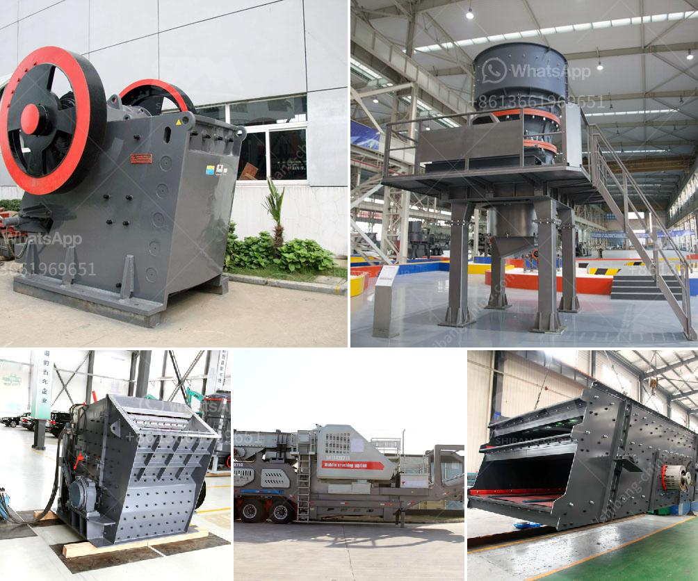

<h3>schredder and grinding mille for sale</h3>
Are you in need of a reliable and efficient shredder or grinding mill? Look no further as we have a wide range of shredders and grinding mills available for sale. Whether you are in the recycling industry, agricultural sector, or need equipment for industrial purposes, we have the perfect solution for you.

Our shredders are designed to handle various types of materials, including plastics, metals, wood, and more. With their powerful cutting blades, they can efficiently reduce bulky items into smaller, more manageable sizes. This not only saves space but also facilitates the recycling process. Our shredders offer ease of use, durability, and high performance.

When it comes to grinding mills, we offer a variety of options tailored to your specific needs. Our mills are designed to pulverize different materials into fine powders or particles. Whether you are grinding grains for animal feed, processing spices, or refining materials for manufacturing, our grinding mills provide reliable and consistent results. With their sturdy construction and advanced technology, they ensure optimal performance and longevity.

What sets our shredders and grinding mills apart is their exceptional quality and reliability. We prioritize the satisfaction of our customers, which is why we source our equipment from trusted manufacturers with proven track records. Additionally, our experienced team is always ready to assist you in finding the right equipment for your unique requirements.

Moreover, we understand that investing in new machinery can be a significant expense. Therefore, we offer competitive prices for our shredders and grinding mills, making them an affordable solution for businesses and industries of all sizes. We also provide warranty and aftersales support, ensuring that you get the most out of your purchase.

So, whether you need to streamline your recycling process, improve manufacturing efficiency, or enhance productivity on your farm, our shredders and grinding mills are the perfect choice. With their reliable performance, durability, and affordability, you can rely on our equipment to meet your needs and exceed your expectations. Contact us today to explore our wide range of shredders and grinding mills for sale!
<h3>Contact us</h3><ul><li><strong>Whatsapp:&nbsp;<a href="https://wa.me/8613661969651">+8613661969651</a></strong></li><li><a href="https://swt.shibang-china.com/?git&amp;zhl&amp;schredder and grinding mille for sale"><strong>Online Service(chat now)</strong></a></li></ul><h3>Related</h3><ul><li><a href='equipment for grinding calcium carbonate.md'>equipment for grinding calcium carbonate</a></li><li><a href='barite crusher processing plant.md'>barite crusher processing plant</a></li><li><a href='mobile crushing and screening in malaysia.md'>mobile crushing and screening in malaysia</a></li><li><a href='crushing mineral crushing meaning.md'>crushing mineral crushing meaning</a></li><li><a href='minister of gold mining ghana.md'>minister of gold mining ghana</a></li></ul>