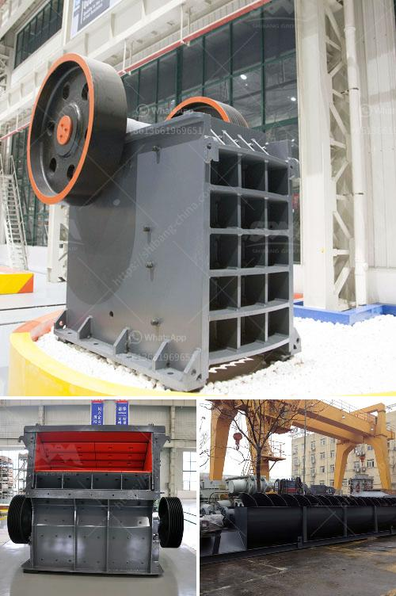

<h3>screen jaw crusher from china</h3>
China is known for its prowess in the manufacturing industry, and one of its most impressive offerings in this sector is the screen jaw crusher. This innovative piece of equipment is revolutionizing the crushing and screening processes in various industries worldwide. With its exceptional efficiency, durability, and versatility, the screen jaw crusher from China has become the go-to choice for many companies seeking to enhance their productivity and cost-effectiveness.

One of the key features that sets the screen jaw crusher apart is its integrated screen. Traditional crushers require additional screening equipment to separate the desired material from the unwanted debris. However, the screen jaw crusher eliminates the need for a separate screening process by incorporating an efficient and robust screen directly into the unit. This not only saves valuable time but also reduces operating costs.

The high-performance screen in the jaw crusher has been designed to handle a wide range of materials and sizes, ensuring that the desired product specifications are met. It effectively separates the fines from the larger particles, preventing any blockages or damage to downstream equipment. This results in a more consistent and high-quality output, which is crucial in industries such as construction, mining, and recycling.

Another remarkable feature of the screen jaw crusher from China is its versatility. It can handle various types of materials, including limestone, granite, and concrete, among others. This makes it suitable for a wide range of applications, from primary crushing to secondary and tertiary crushing. Whether it is used in the demolition of buildings, processing of aggregates, or recycling of construction waste, this equipment delivers outstanding performance every time.

In addition to its impressive functionality, the screen jaw crusher is also a highly durable and reliable machine. It has been engineered to withstand the harsh operating conditions typically encountered in the industry. The heavy-duty construction, reinforced components, and advanced technologies ensure that the crusher can withstand the toughest materials and extended operation without compromising on its performance.

The screen jaw crusher from China also boasts of its user-friendly design. With its intuitive controls, operators can easily adjust the settings to achieve the desired particle size and output. The easy access to the maintenance points and the quick and simple replacement of wear parts further enhance the overall ease of use and efficiency.

China's screen jaw crusher is quickly gaining popularity in the global market due to its exceptional performance, reliability, versatility, and cost-effectiveness. Its innovative design, integrated screen, and durable construction make it a game-changer in the crushing and screening industry. With its ability to handle various materials and applications, it is the ideal solution for companies aiming to boost their productivity and profitability. As demand for high-quality aggregates and efficient recycling processes continues to grow, the screen jaw crusher from China is set to play a pivotal role in meeting these needs.
<h3>Contact us</h3><ul><li><strong>Whatsapp:&nbsp;<a href="https://wa.me/8613661969651">+8613661969651</a></strong></li><li><a href="https://swt.shibang-china.com/?git&amp;zhl&amp;screen jaw crusher from china"><strong>Online Service(chat now)</strong></a></li></ul><h3>Related</h3><ul><li><a href='barite production process.md'>barite production process</a></li><li><a href='diagram of vertical hammer mill.md'>diagram of vertical hammer mill</a></li><li><a href='used gold mining equipment for sale in south africa.md'>used gold mining equipment for sale in south africa</a></li><li><a href='kenya electrical jaw crusher 32 x 58.md'>kenya electrical jaw crusher 32 x 58</a></li><li><a href='used crusher for sale in pakistan.md'>used crusher for sale in pakistan</a></li></ul>