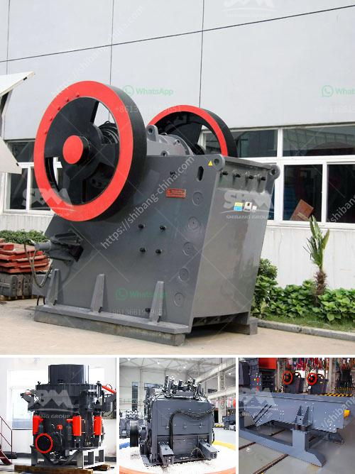

<h3>screening plant for hire south africa</h3>
Screening plants play a crucial role in various industries, and South Africa is no exception. With its booming mining sector and rapidly growing construction industry, there is a high demand for screening plants for hire in the country. These screening plants are used to separate bulk materials into different sizes, allowing for more efficient processing and usage in various applications.

One of the major advantages of hiring screening plants in South Africa is the cost-effectiveness it offers. Purchasing screening plants outright can be quite expensive, especially for smaller businesses or projects with a limited budget. On the other hand, hiring screening plants allows businesses to access the required equipment without the burden of long-term financial commitments. It also eliminates the need for maintenance, repairs, and storage costs, as the rental company takes care of these aspects.

Furthermore, hiring screening plants provides businesses with flexibility. Different projects may have varying demands in terms of capacity, size, and mobility of the screening plant required. By opting for plant hire, businesses have the option to choose the most suitable equipment for each specific project, ensuring optimal performance and cost savings.

South Africa is known for its diverse landscapes and terrains, making it essential to have versatile screening plants that can handle different environments. From arid deserts to coastal areas, these screening plants need to be robust and reliable. Many plant hire companies in South Africa offer a wide range of screening plants suitable for various applications, such as sand, gravel, coal, limestone, and more. These plants often come equipped with advanced features that enhance productivity, ease of use, and overall performance.

In addition to the equipment itself, hiring screening plants usually includes expert support and maintenance services. Rental companies typically provide skilled operators who are familiar with the specific screening plant, ensuring smooth operation and maximum efficiency. They also offer regular maintenance and repairs as part of the rental agreement, reducing downtime and avoiding costly breakdowns.

The screening plant hire industry in South Africa is highly competitive, with several companies offering these services. When selecting a rental provider, it is crucial to consider factors such as reputation, experience, equipment quality, and customer service. Reading reviews and testimonials from previous clients can provide valuable insights into the reliability and professionalism of the rental company.

In conclusion, screening plants for hire in South Africa are in high demand due to the country's thriving mining and construction industries. Hiring these plants offers numerous benefits, including cost-effectiveness, flexibility, and access to versatile equipment suitable for various applications and terrains. It also provides expert support and maintenance services, ensuring optimal performance and minimizing downtime. Whether it's for short-term projects or long-term operations, renting screening plants is a practical and efficient solution for businesses in South Africa.
<h3>Contact us</h3><ul><li><strong>Whatsapp:&nbsp;<a href="https://wa.me/8613661969651">+8613661969651</a></strong></li><li><a href="https://swt.shibang-china.com/?git&amp;zhl&amp;screening plant for hire south africa"><strong>Online Service(chat now)</strong></a></li></ul><h3>Related</h3><ul><li><a href='mica crushing processing in nigeria.md'>mica crushing processing in nigeria</a></li><li><a href='aggregate crusher plant layout.md'>aggregate crusher plant layout</a></li><li><a href='busines project proposal for stone crusher.md'>busines project proposal for stone crusher</a></li><li><a href='mobile mini crusher hire.md'>mobile mini crusher hire</a></li><li><a href='100tpd complete gold plant.md'>100tpd complete gold plant</a></li></ul>