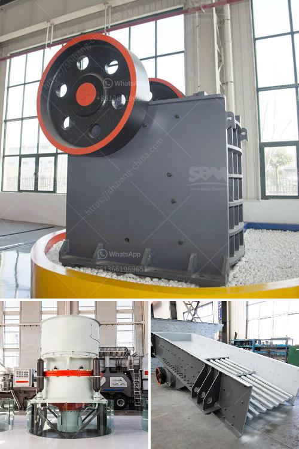

<h3>second hand stone crusher sale in india</h3>
Second hand stone crusher machines are purchased in many countries, including India. When it comes to buying a used stone crusher machine, the first thing that strikes our mind is its efficiency and operational proficiency. This is largely due to the fact that older machines were created decades ago and thus, require a considerable amount of maintenance and upkeep. However, with the right knowledge and expertise, buying a second hand stone crusher machine can provide numerous benefits for businesses in India.

One of the main advantages of purchasing a second hand stone crusher machine is that it is cost-effective. Since users do not have the resources to invest in new machinery, often opting for a second hand machine allows them to save on the initial purchase price. Moreover, since most second hand crushers are sold by individuals or small-scale businesses, they might be willing to negotiate the price, making it even more affordable for buyers.

Second hand stone crushing machines are also environmentally friendly due to their low carbon footprint. Compared to new stone crushers, second hand machines have a reduced impact on the environment as they utilize less energy. Additionally, these machines produce less noise and dust, which ensures a safe and healthy working environment for employees.

In terms of performance, second hand stone crusher machines have a significant advantage over their newer counterparts. As these machines have been tried and tested over time, their performance is more reliable than that of new machines. Furthermore, second hand stone crushers in India have a longer lifespan, apart from reducing the operational and maintenance costs.

Another advantage of purchasing second hand stone crusher machines is that refurbished crushers are often as good as new. The original manufacturer or supplier will have already performed necessary repairs and replacements, ensuring the machine's optimal working condition. Additionally, buyers can further inspect the machine or request a demonstration to ensure that it meets their specific requirements.

When buying second hand stone crushers, it is essential to pay attention to factors such as the machine's usage history, the condition of its components, and its overall durability. Buyers should thoroughly inspect the machine, checking for any signs of wear and tear or potential breakdowns. It is advisable to seek the assistance of an experienced engineer or technician to assess the machine's condition before making a purchase.

In conclusion, purchasing a second hand stone crusher machine in India can provide numerous benefits for businesses. The cost-effectiveness, environmental friendliness, and reliable performance make these machines a smart investment option. However, buyers should exercise caution and ensure they thoroughly inspect the machine to ensure its optimal working condition. By buying a second hand stone crusher, businesses can save money, reduce their carbon footprint, and benefit from a machine that has been tried and tested over time.
<h3>Contact us</h3><ul><li><strong>Whatsapp:&nbsp;<a href="https://wa.me/8613661969651">+8613661969651</a></strong></li><li><a href="https://swt.shibang-china.com/?git&amp;zhl&amp;second hand stone crusher sale in india"><strong>Online Service(chat now)</strong></a></li></ul><h3>Related</h3><ul><li><a href='cost to setup cement plant industry.md'>cost to setup cement plant industry</a></li><li><a href='diamants usine de lavage mobiles.md'>diamants usine de lavage mobiles</a></li><li><a href='limestone crusher secondary machine price.md'>limestone crusher secondary machine price</a></li><li><a href='used horizontal impact crusher hazemag.md'>used horizontal impact crusher hazemag</a></li><li><a href='kaolin processing crusher uganda.md'>kaolin processing crusher uganda</a></li></ul>