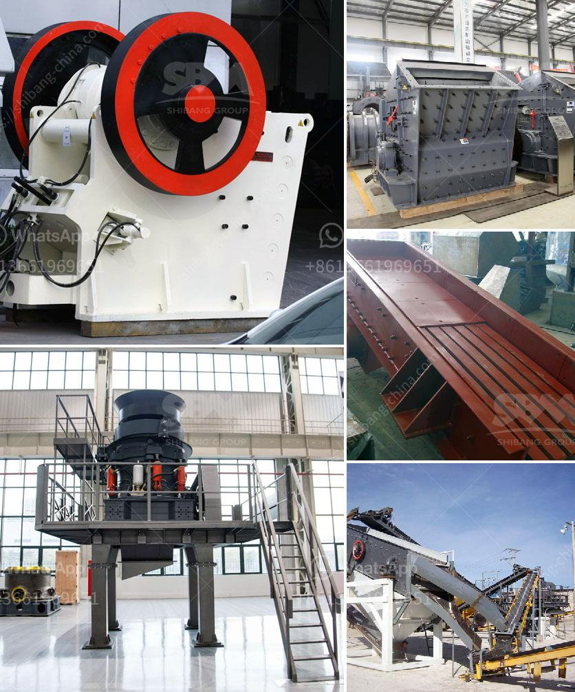

<h3>selling ball mill thailand</h3>
Thailand has long been recognized as a hub for industrial and economic growth in Southeast Asia. With its well-developed infrastructure, skilled workforce, and supportive business environment, the country continues to attract foreign investments across various sectors. As the demand for raw materials and manufacturing processes continues to increase, so does the need for efficient and reliable equipment in factories and production plants. One such equipment that plays a crucial role in many industries is the ball mill.

A ball mill is a device that grinds materials into fine powders using cylindrical balls or other grinding media. It is commonly used in the mining, ceramics, and chemical industries, among others. The mill works by rotating on its axis while the balls inside grind the material, resulting in a fine powder or slurry.

Thailand, with its growing industrial sectors, offers a significant market for selling ball mills. Mining operations, for instance, require ball mills to crush and grind ore into smaller particles for further processing. Likewise, ceramic manufacturers utilize ball mills to produce fine ceramic powders used in various applications like tiles, porcelain, and pottery. The chemical industry, too, relies on ball mills to grind and mix chemicals for the production of fertilizers, pigments, and pharmaceuticals.

For manufacturers and suppliers of ball mills, Thailand is a prime market to tap into. With a wide range of established and emerging industries, there is a constant demand for high-quality and efficient grinding equipment. Thai businesses are also keen on leveraging the latest technologies and environmentally friendly practices, which translates to a growing interest in advanced ball mill solutions.

To successfully market and sell ball mills in Thailand, manufacturers and suppliers should highlight the following key aspects:

1. Quality and durability: Emphasize the reliability and longevity of the equipment, ensuring customers that the ball mills are built to last.

2. Efficiency and productivity: Showcase how the ball mills can enhance production processes and improve overall efficiency, resulting in cost savings and higher output.

3. Customization and after-sales support: Offer tailored solutions and provide comprehensive aftersales services to meet the specific requirements of Thai industries.

4. Environmental sustainability: Highlight any eco-friendly features of the ball mills, such as energy-efficient motors or reduced emissions, to align with Thailand's increasing emphasis on sustainability.

Furthermore, building strong partnerships with local distributors and engaging in targeted marketing campaigns will help manufacturers capture the attention of potential buyers.

As Thailand continues to develop and modernize its industries, the demand for high-quality grinding equipment like ball mills will likely remain strong. By understanding the market dynamics, addressing customer needs, and positioning themselves as reliable and innovative suppliers, businesses selling ball mills in Thailand can unlock significant opportunities for growth and expansion.
<h3>Contact us</h3><ul><li><strong>Whatsapp:&nbsp;<a href="https://wa.me/8613661969651">+8613661969651</a></strong></li><li><a href="https://swt.shibang-china.com/?git&amp;zhl&amp;selling ball mill thailand"><strong>Online Service(chat now)</strong></a></li></ul><h3>Related</h3><ul><li><a href='gold mining equipment pdf.md'>gold mining equipment pdf</a></li><li><a href='ball mill prices and for sale ghana.md'>ball mill prices and for sale ghana</a></li><li><a href='gypsum production line used.md'>gypsum production line used</a></li><li><a href='stone crusher manufacturers in mumbai.md'>stone crusher manufacturers in mumbai</a></li><li><a href='crusher machine nigeria.md'>crusher machine nigeria</a></li></ul>