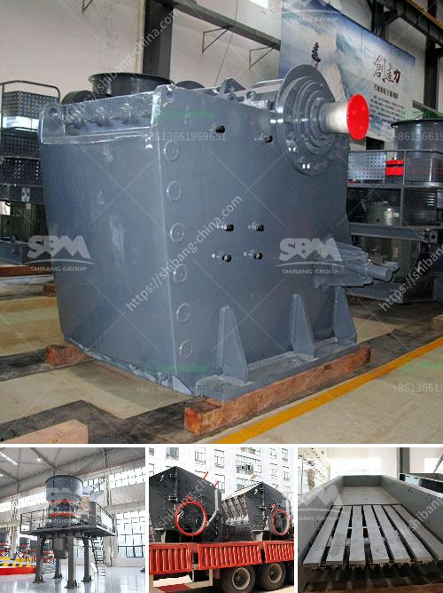

<h3>selling stone crusher plant</h3>
Stone crushing is a craft that has been long practiced in the country of India. The people of India have embraced this machinery and have witnessed a steady growth in its popularity over the past few years. An increase in the number of stone crusher plants has led to a substantial increase in overall job opportunities.

Stone crushing is a process that involves a high level of precision and quality assurance. Utilizing a stone crusher plant, the stones are crushed by heavy-duty machines before they are released into the final product stage for screening and grading. The stone crusher plant offers multiple benefits to manufacturers, making it highly lucrative.

In this initial stage of industrial growth, a significant investment is necessary in order to set up a stone crushing plant. However, entrepreneurs can easily recoup the cost within a short span of time by selling their products directly to construction and building companies. These companies are constantly seeking high-quality crushed stones for various construction purposes, making the demand for stone crusher plants consistently high.

The competition in the stone crushing market is fierce, so entrepreneurs should make wise decisions when purchasing crushing equipment. Various factors need to be considered, such as the quality, price, capacity, and maintenance requirements of the stone crusher plant. It is essential to assess these factors before investing.

Once all these aspects are considered, entrepreneurs can successfully establish and sell stone crusher plants to construction and building companies. In addition, they can also supply crushed stones to local councils, road development agencies, and private entities involved in infrastructure projects.

To effectively market stone crusher plants, entrepreneurs should consider implementing online platforms and advertising campaigns. Utilizing social media platforms, creating informative websites, and investing in search engine optimization will help attract potential buyers.

Stone crusher plants can prove to be a great business opportunity for entrepreneurs. However, it is crucial to conduct thorough market research and understand the needs and demands of potential customers. By offering high-quality products and excellent customer service, entrepreneurs can build a solid reputation and ensure long-term success in the stone crushing industry.
<h3>Contact us</h3><ul><li><strong>Whatsapp:&nbsp;<a href="https://wa.me/8613661969651">+8613661969651</a></strong></li><li><a href="https://swt.shibang-china.com/?git&amp;zhl&amp;selling stone crusher plant"><strong>Online Service(chat now)</strong></a></li></ul><h3>Related</h3><ul><li><a href='calcium carbonate process flow diagram.md'>calcium carbonate process flow diagram</a></li><li><a href='cost of equipment used in mining lead ore.md'>cost of equipment used in mining lead ore</a></li><li><a href='pakistan coal crushing plant in peshawar.md'>pakistan coal crushing plant in peshawar</a></li><li><a href='coal crushing and screening plant in south africa.md'>coal crushing and screening plant in south africa</a></li><li><a href='difference between sand and crushed stone powder.md'>difference between sand and crushed stone powder</a></li></ul>