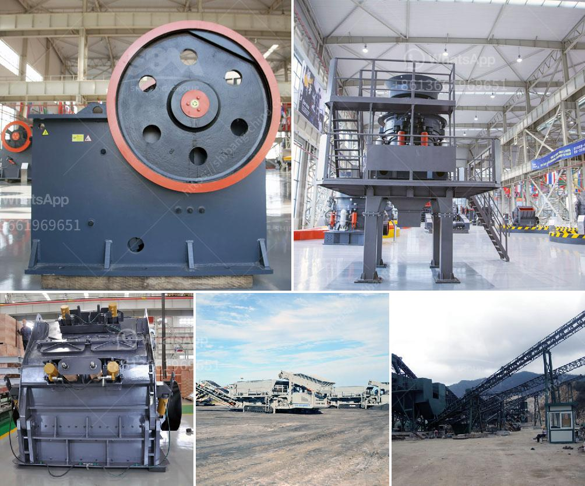

<h3>set up a quarry business</h3>
Setting up a quarry business is a critical process. It requires substantial investment, planning, and diligent execution to ensure profitability and sustainability in the long run. A quarry is essentially a vast open pit where stone, rock, and gravel are extracted for construction and other purposes. If you are considering starting a quarry business, here are some essential steps to help you get started.

Firstly, conduct thorough market research to understand the demand for quarry products in your area. Assess the competition, identify potential customers, and determine the quantity and quality of stones required. This market analysis will help you make informed decisions regarding the size and scope of your quarry operation.

Secondly, secure a suitable location for your quarry. Consider factors such as proximity to target markets and accessibility to transportation channels. It is also necessary to obtain all the required permits and licenses from local authorities to ensure compliance with regulations and legal obligations.

Thirdly, you need to acquire the necessary equipment and machinery for extracting and processing stones efficiently. This includes tools like crushers, screeners, loaders, and trucks. Evaluate your budget and choose the equipment that suits your requirements and financial capacity.

Next, hire skilled and experienced personnel to operate the quarry. Having a well-trained workforce is essential to ensure smooth operations and maintain high production standards. Invest in training programs to enhance their skills and overall productivity.

Furthermore, establish strong relationships with suppliers and contractors to ensure a consistent supply of raw materials and a reliable network for selling your products. Marketing and promoting your quarry business through various channels, such as online platforms and local directories, will also help attract potential customers.

Lastly, implement sustainable and environmentally friendly practices in your quarry. Regulate the usage of explosives, minimize pollution, and adopt restoration programs to rehabilitate the site once the quarrying activities conclude.

In conclusion, setting up a quarry business may be a challenging undertaking, but with careful planning and diligent execution, it can be a rewarding venture. Consider conducting market research, securing a suitable location, acquiring the necessary equipment, hiring skilled personnel, and adopting sustainable practices. By following these steps, you can take the first steps towards establishing a successful and profitable quarry business.
<h3>Contact us</h3><ul><li><strong>Whatsapp:&nbsp;<a href="https://wa.me/8613661969651">+8613661969651</a></strong></li><li><a href="https://swt.shibang-china.com/?git&amp;zhl&amp;set up a quarry business"><strong>Online Service(chat now)</strong></a></li></ul><h3>Related</h3><ul><li><a href='complete stone quarry plant.md'>complete stone quarry plant</a></li><li><a href='ball mill in malaysia.md'>ball mill in malaysia</a></li><li><a href='cement ball mills charging.md'>cement ball mills charging</a></li><li><a href='manufacture of vibrating screens.md'>manufacture of vibrating screens</a></li><li><a href='gypsum board machinery manufacturers turkey.md'>gypsum board machinery manufacturers turkey</a></li></ul>