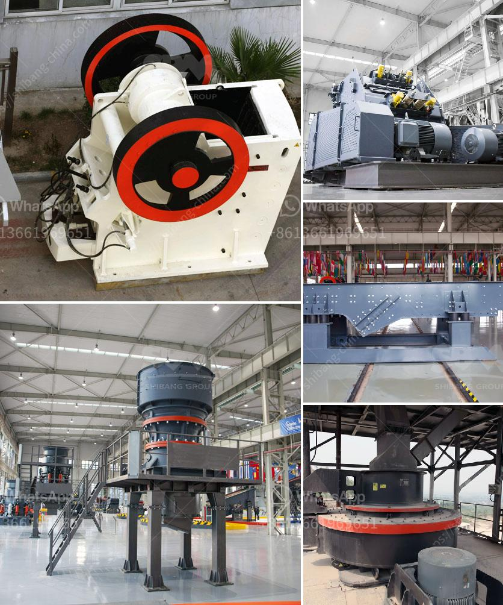

<h3>shell powder making machine grinding mill for sale</h3>
In the modern world, people are becoming more and more conscious about their health. As a result, alternative medicine has gained significant popularity in recent years. One such alternative medicine ingredient that has gained traction is shell powder. Shell powder is made by grinding the shells of various natural substances, such as oyster shells, eggshells, and seashells, into a fine powder. This powder is then used in a variety of applications, including traditional medicine, cosmetics, and even in the production of dietary supplements.

To meet the growing demand for shell powder, manufacturers have developed advanced machinery that can efficiently grind shells into the desired fine powder consistency. One such machine is the shell powder making machine, a grinding mill for sale. This machine is designed to pulverize shells and turn them into powder of varying fineness. Depending on the requirements, the output particle size can range from as coarse as 10 mesh to as fine as 3000 mesh.

The shell powder making machine features a simple but efficient design. It consists of the main grinding chamber, a motor, a feeder, and a cyclone collector. The shell materials are fed into the grinding chamber through the feeder and are pulverized by the rotating hammers. The rotation of the hammers creates centrifugal force, which forces the ground materials to pass through the screen and into the cyclone collector. The cyclone collector separates the fine powder from the airflow and stores it for further use.

One of the key advantages of the shell powder making machine is its versatility. It can be used to grind a wide range of shells, including oyster shells, eggshells, clam shells, and seashells. This makes it suitable for various applications, such as the production of traditional Chinese medicine, calcium supplements, animal feed additives, and cosmetics.

Furthermore, the shell powder making machine is relatively easy to operate and maintain. It comes with a user-friendly interface and requires minimal training to operate. Additionally, the machine is equipped with safety features to prevent accidents and ensure operator safety.

When purchasing a shell powder making machine, it is essential to consider several factors. Firstly, it is crucial to choose a reputable manufacturer that provides high-quality machines. It is advisable to read customer reviews, inspect the machine's specifications, and seek professional advice before making a purchase.

Secondly, one should determine the required output capacity of the machine. Different models of shell powder making machines have varying production capacities, and it is crucial to choose one that meets the specific needs of the application.

Lastly, one should consider the price range. The cost of a shell powder making machine varies depending on factors such as the brand, model, and additional features. It is essential to compare prices from different suppliers and choose a machine that offers the best value for money.

In conclusion, the shell powder making machine is a useful tool for grinding shells into fine powder for various applications. With its efficient design, versatility, and ease of operation and maintenance, it is a valuable asset for manufacturers in the alternative medicine, cosmetics, and dietary supplement industries. When purchasing a shell powder making machine, it is essential to consider factors such as the reputation of the manufacturer, the required output capacity, and the price range. By choosing the right machine, manufacturers can meet the increasing demand for shell powder and tap into the growing market of alternative medicine.
<h3>Contact us</h3><ul><li><strong>Whatsapp:&nbsp;<a href="https://wa.me/8613661969651">+8613661969651</a></strong></li><li><a href="https://swt.shibang-china.com/?git&amp;zhl&amp;shell powder making machine grinding mill for sale"><strong>Online Service(chat now)</strong></a></li></ul><h3>Related</h3><ul><li><a href='supplier of conveyor belt kenya.md'>supplier of conveyor belt kenya</a></li><li><a href='jaw crusher price list 150 x 200mm.md'>jaw crusher price list 150 x 200mm</a></li><li><a href='gold mining mills in south africa.md'>gold mining mills in south africa</a></li><li><a href='grinding crushing mill brick.md'>grinding crushing mill brick</a></li><li><a href='stone crushing equipment price in nigeria.md'>stone crushing equipment price in nigeria</a></li></ul>