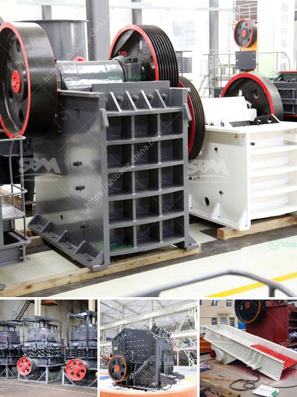

<h3>silica mining technology production line</h3>
Silica, also known as silicon dioxide, is one of the most abundant minerals on Earth and is widely used in various industries. From glass manufacturing to construction, silicon dioxide plays a crucial role in countless applications. As the demand for silica continues to grow, mining companies are continuously improving their technology and production lines to ensure a sustainable supply.

Technological advancements in silica mining have significantly enhanced the efficiency and safety of the extraction process. The traditional method of mining silica involved manual labor, with miners using hand tools to dig pits and extract the mineral. However, this approach was not only time-consuming but also posed numerous health risks to the workers due to exposure to hazardous silica dust.

Today, modern mining technology has revolutionized the silica extraction process. Heavy machinery, such as excavators, bulldozers, and conveyor belts, are now commonly used to streamline the mining operations. This mechanized approach not only increases the rate of silica extraction but also minimizes the risk of physical injuries and exposure to harmful dust particles.

Furthermore, advancements in drilling and blasting techniques have significantly improved the efficiency of silica mining. Mining companies now employ precision drilling methods to extract silica deposits more accurately. By minimizing wastage and optimizing the extraction process, these advanced techniques ensure a higher yield of silica while reducing overall operational costs.

The production line for silica mining has also witnessed significant improvements. Sophisticated processing and beneficiation techniques are employed to purify the extracted silica and ensure high-quality end products. These techniques involve washing, screening, and gravity separation to remove impurities, resulting in silica with higher purity levels.

The use of state-of-the-art equipment also plays a crucial role in enhancing the production line's efficiency. Conveyor belts and sorting systems enable easy transportation of silica ore, reducing downtime and increasing productivity. Moreover, automated systems have been integrated into the production line, allowing real-time monitoring and optimization of various parameters, ensuring a smooth and efficient operation.

However, as the demand for silica continues to rise, sustainability has become a significant concern. Mining companies are increasingly adopting environmentally friendly practices to minimize their impact on the ecosystem. For instance, water recycling systems are implemented to reduce water consumption during the production process. Additionally, efforts are made to minimize energy consumption by utilizing renewable energy sources, such as solar and wind power, to run mining operations.

Moreover, reclamation and rehabilitation programs are undertaken to restore the mined areas and ensure their long-term sustainability. Afforestation and soil conservation measures are implemented to reclaim the land, promoting biodiversity and preserving the natural balance of the ecosystem.

In conclusion, advancements in technology have greatly improved the efficiency and sustainability of silica mining operations. From the extraction process to the production line, modern techniques and equipment have revolutionized the industry, ensuring a continuous supply of high-quality silica. By prioritizing environmental conservation and worker safety, the mining sector can meet the growing demand for silica while minimizing its ecological footprint.
<h3>Contact us</h3><ul><li><strong>Whatsapp:&nbsp;<a href="https://wa.me/8613661969651">+8613661969651</a></strong></li><li><a href="https://swt.shibang-china.com/?git&amp;zhl&amp;silica mining technology production line"><strong>Online Service(chat now)</strong></a></li></ul><h3>Related</h3><ul><li><a href='rock milling and grinding machine.md'>rock milling and grinding machine</a></li><li><a href='mini copper ore extraction plant.md'>mini copper ore extraction plant</a></li><li><a href='gold mining equipment nevada oregon used rock crushers.md'>gold mining equipment nevada oregon used rock crushers</a></li><li><a href='granite quarry machines.md'>granite quarry machines</a></li><li><a href='price crusher mill price stone crusher.md'>price crusher mill price stone crusher</a></li></ul>