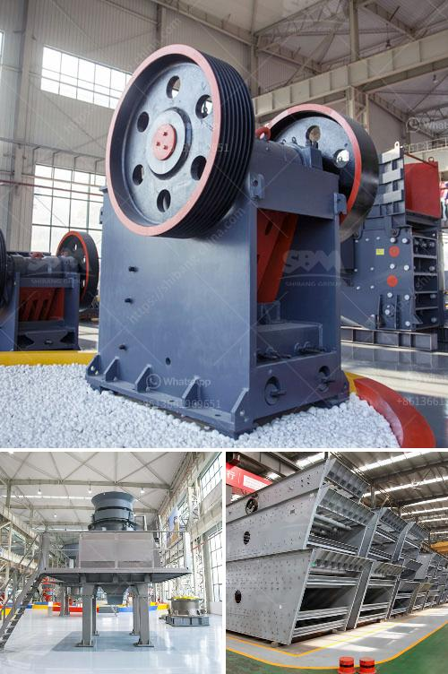

<h3>silica sand beneficiation plant for glass</h3>
Silica sand beneficiation plant is used to separate the impurities from the silica sand to enrich its quality and purity for various industrial applications. The commonly used beneficiation techniques follow the principles of gravity and magnetic separation, and flotation techniques to separate the silica sand impurities such as iron oxide, aluminum oxide, mica, titanium dioxide, and other materials.

Glass manufacturing is one of the largest and fastest-growing applications for silica sand. Silica sand is the primary raw material used to make glass. Glass is a versatile material with endless applications, ranging from windows and bottles to touchscreen displays and solar panels. The quality and purity of silica sand are crucial for the glass industry as it directly impacts the final product's transparency, strength, and durability.

The beneficiation process of silica sand for glass primarily includes screening, washing, and desliming to remove undesirable impurities such as iron oxide, mica, and other materials. The silica sand particles are then subjected to flotation, magnetic separation, and other techniques to further refine the silica sand grade.

The silica sand beneficiation plant will deliver high-quality glass-grade silica sand suitable for a wide range of glass manufacturing industries. The newly designed plant includes state-of-the-art equipment that will provide high efficiency, reliability, and the flexibility to accommodate the varying demands of different glass manufacturers.

Investing in a silica sand beneficiation plant for glass manufacturing ensures a constant and reliable supply of high-quality silica sand. This strengthens the glass manufacturing industry's competitive position, improves the overall quality of the glass products, and contributes to the growth and development of the global glass industry.

Furthermore, a silica sand beneficiation plant for glass production promotes sustainable development by reducing the environmental impact associated with excessive mining and extraction of natural resources. By utilizing beneficiation techniques, the extraction of raw material can be optimized, minimizing waste generation, and conserving energy and water resources.

In conclusion, a silica sand beneficiation plant for glass production plays a crucial role in enhancing glass manufacturing processes, ensuring high-quality silica sand supply, and promoting sustainable development. Investing in this plant will result in improved competitiveness, increased productivity, and a greener approach to glass manufacturing.
<h3>Contact us</h3><ul><li><strong>Whatsapp:&nbsp;<a href="https://wa.me/8613661969651">+8613661969651</a></strong></li><li><a href="https://swt.shibang-china.com/?git&amp;zhl&amp;silica sand beneficiation plant for glass"><strong>Online Service(chat now)</strong></a></li></ul><h3>Related</h3><ul><li><a href='used clay powder drying machinery.md'>used clay powder drying machinery</a></li><li><a href='granite quarry machines.md'>granite quarry machines</a></li><li><a href='quarry business cost in india.md'>quarry business cost in india</a></li><li><a href='stone quarry business proposal.md'>stone quarry business proposal</a></li><li><a href='price of mobile stone crusher.md'>price of mobile stone crusher</a></li></ul>