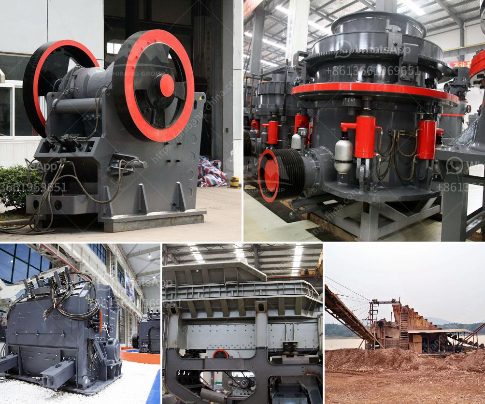

<h3>silica sand concrete in ethiopia</h3>
When it comes to construction, choosing the right building materials is imperative for the success of any project. In Ethiopia, one material that is widely used in the construction industry is silica sand concrete. Silica sand concrete is a mixture of cement, water, and aggregates that is reinforced with fine silica sand particles. This type of concrete offers several benefits, making it a popular choice among builders and contractors in Ethiopia.

One of the key advantages of silica sand concrete is its high strength and durability. The addition of fine silica sand particles enhances the compressive strength of the concrete, making it suitable for heavy and high-stress applications. This is particularly important in Ethiopia, where buildings need to withstand the country's ever-changing climate, including periods of heavy rainfall and extreme temperatures.

Silica sand concrete also offers excellent resistance against chemical attacks. The presence of silica particles acts as a protective barrier against harmful substances, such as acids and alkalis. This is especially crucial in industrial areas, where exposure to chemicals is common. By choosing silica sand concrete, builders in Ethiopia can ensure that their structures are built to last and will not suffer significant damage due to chemical corrosion.

Another significant advantage of using silica sand concrete is its low thermal conductivity. Ethiopia experiences a wide range of temperature variations throughout the year, from scorching summers to freezing winters. Silica sand particles in the concrete help reduce heat transfer, making buildings more energy-efficient and comfortable for their occupants. This is not only beneficial in terms of reducing energy consumption but also plays a crucial role in promoting sustainable construction practices in Ethiopia.

In addition to its technical advantages, silica sand concrete is also economically viable. Silica sand is readily available in Ethiopia, making it a cost-effective alternative to other building materials. Its abundance contributes to the affordability of construction projects, ensuring that more infrastructures can be built within allocated budgets. This makes silica sand concrete a particularly suitable choice for government-funded projects and developments in Ethiopia.

However, despite its numerous benefits, it is essential to handle silica sand with care. Silica particles can be harmful when inhaled, which can lead to respiratory problems and other health issues. Therefore, proper safety measures should be taken when working with silica sand concrete, such as using protective equipment and implementing adequate ventilation.

In conclusion, silica sand concrete is a valuable building material in Ethiopia, offering strength, durability, resistance to chemical attacks, thermal insulation, and cost-effectiveness. By incorporating silica sand particles into concrete mixes, builders in Ethiopia can construct structures that are capable of withstanding the country's harsh weather conditions, while also promoting energy efficiency. Nonetheless, it is essential to prioritize safety and ensure that proper precautions are taken to prevent any medical issues associated with silica sand exposure. In the rapidly developing nation of Ethiopia, silica sand concrete is proving to be an asset in bolstering the country's infrastructure and creating sustainable buildings for the future.
<h3>Contact us</h3><ul><li><strong>Whatsapp:&nbsp;<a href="https://wa.me/8613661969651">+8613661969651</a></strong></li><li><a href="https://swt.shibang-china.com/?git&amp;zhl&amp;silica sand concrete in ethiopia"><strong>Online Service(chat now)</strong></a></li></ul><h3>Related</h3><ul><li><a href='kenya jaw crusher is manufactured.md'>kenya jaw crusher is manufactured</a></li><li><a href='stone crusher sri lanka.md'>stone crusher sri lanka</a></li><li><a href='construction debris recycling.md'>construction debris recycling</a></li><li><a href='grinding garnet machine.md'>grinding garnet machine</a></li><li><a href='how different impact crusher and hammer mill.md'>how different impact crusher and hammer mill</a></li></ul>