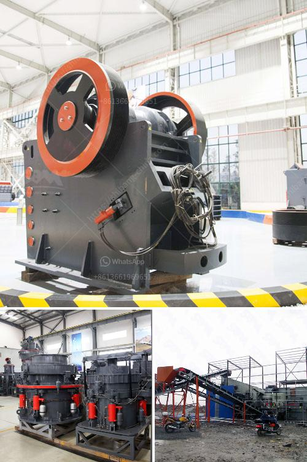

<h3>silica sand mining equipment</h3>
Silica sand is a naturally occurring granular material composed of quartz and other minerals. It is one of the most common substances found in the earth's crust, making it an essential ingredient in a wide range of industries, from construction to electronics. Silica sand mining is a major industry in many countries where sand is abundant, such as the United States and India. However, the process of mining silica sand has raised concerns about potential environmental and health impacts.

To extract silica sand from the earth, miners must use heavy equipment and chemicals to remove the layers of soil and rock covering the sand deposits. This process typically involves the use of large bulldozers and excavators to remove overburden and other layers of earth. Once the sand is exposed, it is then transported to a processing plant where it is crushed, washed, and dried before being shipped to various industries.

The equipment used in silica sand mining includes crushing machines, screening plants, and grinding mills for pulverizing the sand grains into smaller sizes. These machines help reduce the larger rocks or gravel into a more manageable size, improving the efficiency of the subsequent processing steps. In addition to these primary machines, auxiliary equipment like conveyors, screens, and dust control systems are also utilized to ensure a smooth and safe operation.

Furthermore, it is crucial to note that the mining and processing of silica sand can have significant environmental and health impacts. The removal of vegetation, soil erosion, and the diversion of water courses are just a few of the potential consequences. Additionally, the dust generated during the mining process can pose respiratory risks to the workers involved. Proper safety measures and precautions, including personal protective equipment, must be adhered to protect both workers and the surrounding environment.

In conclusion, silica sand mining is a vital industry that supports various sectors of the economy. The equipment used in this process plays a crucial role in extracting and processing the sand while minimizing environmental and health impacts. However, it is essential to ensure that sustainable practices are implemented to mitigate any potential negative effects associated with mining operations.
<h3>Contact us</h3><ul><li><strong>Whatsapp:&nbsp;<a href="https://wa.me/8613661969651">+8613661969651</a></strong></li><li><a href="https://swt.shibang-china.com/?git&amp;zhl&amp;silica sand mining equipment"><strong>Online Service(chat now)</strong></a></li></ul><h3>Related</h3><ul><li><a href='granite quarry companies in europe.md'>granite quarry companies in europe</a></li><li><a href='crushing efficiency of ball mill.md'>crushing efficiency of ball mill</a></li><li><a href='metal conveyor belts in plates.md'>metal conveyor belts in plates</a></li><li><a href='mills price of hammer mills.md'>mills price of hammer mills</a></li><li><a href='coal mining equipment in spain.md'>coal mining equipment in spain</a></li></ul>