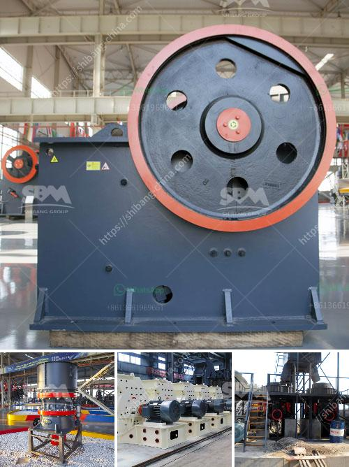

<h3>silica sand powder machine indonesia</h3>
Silica sand is a mineral resource that is widely utilized in various industries, including construction, glassmaking, and foundry work. Silica sand is abundant in Indonesia, and its deposits have been exploited since ancient times, making it one of the country's most valuable commodities. In recent years, the demand for silica sand powder machines has grown significantly due to the increasing use of silica sand powder in various industrial applications.

Silica sand powder machines are utilized to crush and grind silica sand into fine particles. These machines consist of a rotor which revolves a high-speed and throws particles against the anvils or plates of the crushing chamber. The grinding process is achieved by the impact and abrasive forces exerted between the particles and the grinding media. The machine's advanced design also ensures the efficient separation and removal of impurities during the grinding process.

One of the main applications of silica sand powder is in the glass industry. Silica sand powder is the primary raw material used to produce glass products. It is mixed with other materials such as soda ash, limestone, and dolomite to create glass containers, flat glass, and fiberglass. The high silica content in silica sand powder ensures the glass produced has excellent transparency, hardness, and durability. Additionally, silica sand powder machines help produce consistent particle sizes, ensuring uniform glass production.

Another significant application of silica sand powder is in the production of ceramics. Silica sand powder is mixed with clay and other ingredients to form a clay body. This mixture is then molded into various shapes and fired at high temperatures to create ceramic products such as tiles, sanitary ware, and tableware. Silica sand powder machines are essential in grinding the raw materials to achieve the desired particle size and consistency. This ensures that the ceramic products have excellent strength, durability, and aesthetic appeal.

Silica sand powder is also used in the foundry industry. Foundries utilize silica sand powder to create molds and cores for casting various metals and alloys. The excellent refractory properties of silica sand allow it to withstand high temperatures and resist thermal shock during the metal casting process. Silica sand powder machines are used to grind, crush, and separate silica sand particles for the production of precision molds and cores. The high-performance silica sand powder helps improve the dimensional accuracy, surface finish, and overall quality of the castings.

Indonesia has abundant silica sand reserves, making it an attractive market for silica sand powder machines. The country's vast coastline and rivers provide ample sources of silica sand, which are readily accessible for mining operations. The local silica sand industry has witnessed significant growth in recent years, driven by the increasing demand from the construction, glassmaking, and foundry sectors.

To cater to the growing demand, several domestic and international companies have invested in silica sand powder machines in Indonesia. These machines are designed to handle large quantities of silica sand and are equipped with advanced grinding technologies to produce high-quality silica sand powder. Additionally, these machines are energy-efficient and environmentally friendly, ensuring sustainable silica sand mining and processing operations.

In conclusion, the demand for silica sand powder machines in Indonesia is expected to continue growing due to the increasing applications of silica sand powder in various industries. The country's abundant silica sand reserves and favorable mining conditions make it an ideal market for silica sand powder machine manufacturers. With ongoing technological advancements and sustainable mining practices, the silica sand powder industry in Indonesia is poised for further expansion, contributing to the country's economic growth.
<h3>Contact us</h3><ul><li><strong>Whatsapp:&nbsp;<a href="https://wa.me/8613661969651">+8613661969651</a></strong></li><li><a href="https://swt.shibang-china.com/?git&amp;zhl&amp;silica sand powder machine indonesia"><strong>Online Service(chat now)</strong></a></li></ul><h3>Related</h3><ul><li><a href='black stone crusher.md'>black stone crusher</a></li><li><a href='gold milling machine for small scale production germany.md'>gold milling machine for small scale production germany</a></li><li><a href='ball mill size.md'>ball mill size</a></li><li><a href='cconveyor belts class.md'>cconveyor belts class</a></li><li><a href='price list coal crushing plant.md'>price list coal crushing plant</a></li></ul>