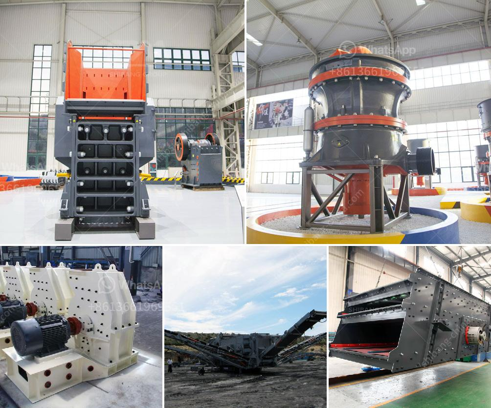

<h3>silica sand stone machine china</h3>
Silica sand is one of the most abundant minerals on the planet and is widely used in various industries, especially construction and glass manufacturing. To meet the growing demand for silica sand, there are several machines used in the production line, such as silica sand stone machine.

China has emerged as the largest producer and exporter of silica sand, owing to its vast reserves and advanced technology in mining and processing. The silica sand stone machine, also known as the sand making machine, is the key equipment in the silica sand production line.

The machine uses high-speed rotation of the impeller to crush the rocks and convert them into silica sand with uniform size and shape. The crushed silica sand is screened and classified into different grades according to particle size. China produces a wide range of silica sand stone machines, catering to different needs and requirements of the industry.

One of the notable features of the silica sand stone machine China is its efficient energy consumption. The machine is designed to reduce energy wastage and maximize productivity, making it cost-effective for businesses. Moreover, it is equipped with advanced safety features to ensure the protection of workers and prevent accidents.

In recent years, China has made significant advancements in the research and development of silica sand stone machines. The machines are now equipped with cutting-edge technologies, such as artificial intelligence and automation, which enhance their performance and efficiency. This has also led to increased production capacity and faster production cycles.

In conclusion, the silica sand stone machine China plays a crucial role in the production of high-quality silica sand. With its advanced technology, energy efficiency, and safety features, it has become a preferred choice for businesses in the silica sand industry. China's continuous investment in research and development is driving the innovation in these machines, ensuring their competitiveness in the global market.
<h3>Contact us</h3><ul><li><strong>Whatsapp:&nbsp;<a href="https://wa.me/8613661969651">+8613661969651</a></strong></li><li><a href="https://swt.shibang-china.com/?git&amp;zhl&amp;silica sand stone machine china"><strong>Online Service(chat now)</strong></a></li></ul><h3>Related</h3><ul><li><a href='machine grinds talcum powder.md'>machine grinds talcum powder</a></li><li><a href='cement vertical mill tph kenya.md'>cement vertical mill tph kenya</a></li><li><a href='mobile gypsum crusher.md'>mobile gypsum crusher</a></li><li><a href='methods of hammer mill.md'>methods of hammer mill</a></li><li><a href='calcium carbonate plants in china.md'>calcium carbonate plants in china</a></li></ul>