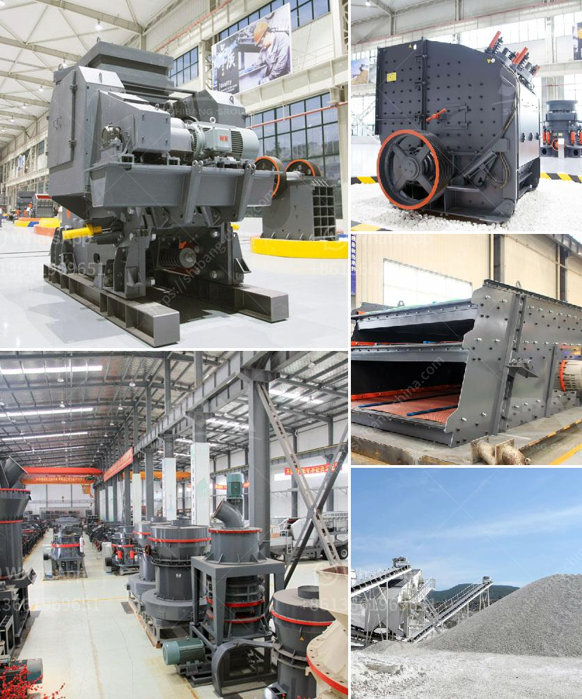

<h3>singapore handheld concrete crusher</h3>
Demolition works are a common sight in the bustling city-state of Singapore. As the city continues to grow and evolve, old buildings are making way for new ones, and the need for efficient demolition methods becomes crucial. One such method that has gained popularity in recent years is the use of handheld concrete crushers.

Handheld concrete crushers are compact, powerful machines that are used to break concrete structures into smaller pieces. These crushers consist of a hydraulic jaw mechanism that allows for the easy and efficient demolition of concrete materials.

One of the key advantages of using handheld concrete crushers is their portability. These machines are designed to be easily carried and transported to the construction site, making them highly convenient for demolition works in tight or hard-to-reach spaces. With their compact size, they can easily maneuver through narrow passageways or confined areas, ensuring a thorough demolition process.

Despite their small size, handheld concrete crushers pack a punch in terms of power and efficiency. Equipped with powerful hydraulic jaws, these crushers are capable of breaking through even the toughest concrete structures. They can effectively crush concrete walls, floors, columns, and slabs, reducing them to manageable sizes for disposal or recycling. This efficiency not only saves time but also reduces the need for additional machinery or equipment, resulting in cost savings for construction and demolition contractors.

One of the notable features of handheld concrete crushers is their ability to selectively demolish specific parts of a structure. The hydraulic jaws can be maneuvered precisely to target specific areas, allowing for controlled demolition and minimizing the risk of collateral damage. This precision is particularly crucial in urban areas like Singapore, where demolitions often take place in close proximity to other buildings or infrastructure.

In recent years, there has been growing awareness and emphasis on environmental sustainability in the construction industry. Handheld concrete crushers contribute to this cause by enabling the recycling of concrete waste. The crushed concrete can be repurposed as a construction material, reducing the need for virgin resources and landfill space. This not only promotes sustainability but also supports Singapore's efforts towards a greener and more eco-friendly future.

Like any construction equipment, safety is of paramount importance when using handheld concrete crushers. Operators should receive proper training and adhere to safety guidelines to ensure accident-free operations. Protective gear such as gloves, goggles, and helmets should be worn to minimize the risk of injury. Additionally, regular maintenance and inspection of the equipment are essential to ensure optimal performance and safety.

In conclusion, handheld concrete crushers have revolutionized the demolition process in Singapore. Their portability, power, and efficiency make them a preferred choice for demolition contractors. They offer convenience, precision, and the ability to recycle concrete waste, contributing to sustainable construction practices. As Singapore continues to evolve and grow, these handheld crushers are set to revolutionize the demolition industry even further.
<h3>Contact us</h3><ul><li><strong>Whatsapp:&nbsp;<a href="https://wa.me/8613661969651">+8613661969651</a></strong></li><li><a href="https://swt.shibang-china.com/?git&amp;zhl&amp;singapore handheld concrete crusher"><strong>Online Service(chat now)</strong></a></li></ul><h3>Related</h3><ul><li><a href='quartz stone production line machinery.md'>quartz stone production line machinery</a></li><li><a href='portable rock crusher.md'>portable rock crusher</a></li><li><a href='conveyor belt pricing in malaysia.md'>conveyor belt pricing in malaysia</a></li><li><a href='portable rock crusher machine.md'>portable rock crusher machine</a></li><li><a href='portable mobile crusher for sale.md'>portable mobile crusher for sale</a></li></ul>