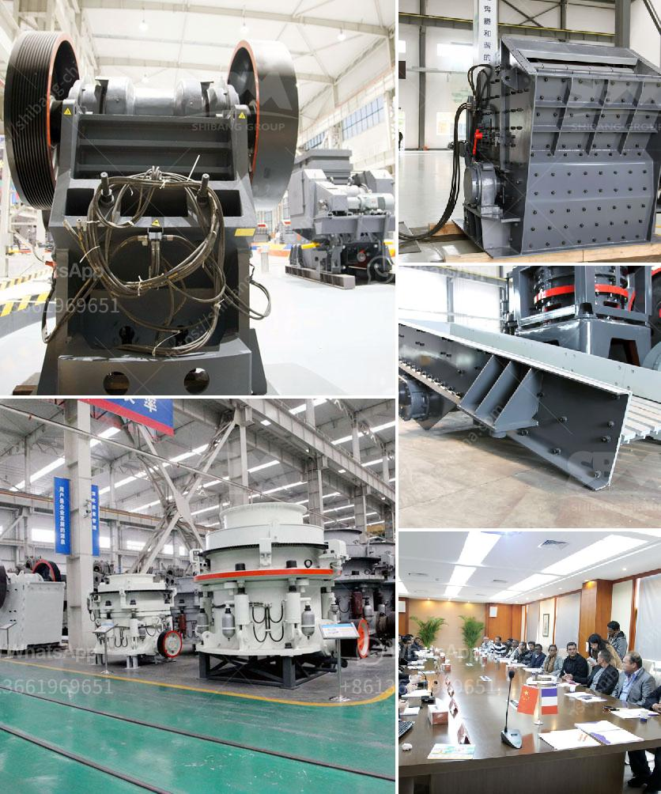

<h3>single toggle jaw crusher</h3>
A jaw crusher machine uses compressive force for breaking of particles. This mechanical pressure is achieved by the two jaws of the crusher of which one is fixed while the other reciprocates. A jaw or toggle crusher consists of a set of vertical jaws, one jaw is kept stationary and is called a fixed jaw while the other jaw called a swing jaw, moves back and forth relative to it, by a cam or pitman mechanism, acting like a class II lever or a nutcracker. The volume or cavity between the two jaws is called the crushing chamber. The movement of the swing jaw can be quite small, since complete crushing is not performed in one stroke. The inertia required to crush the material is provided by a flywheel that moves a shaft creating an eccentric motion that causes the closing of the gap.

A single toggle jaw crusher is a type of jaw crusher where the moving jaw is freely suspended from a shaft at its top edge and the jaw movement is transmitted through toggles near the lower edge. Maximum crushing force is applied to the largest rock particles.

Single toggle jaw crushers are often preferred because they are lighter, simpler and cheaper than double toggle ones. The single toggle movement jaw crusher has the moving jaw driven via an eccentric shaft that moves the rear and front toggles down and up on each shaft revolutions resulting in the jaws meeting the materials at the top or bottom, thereby squeezing the materials in between while moving along a straight line.

The single toggle jaw crusher has a strong crushing body with optimized design parameters that help crushing materials in a uniform manner while minimizing the friction. Therefore, it is an efficient and reliable solution for industries with moderate or low requirements for crushing materials. The single toggle jaw crusher is capable of handling hard and abrasive materials efficiently, with high reduction ratios.

In conclusion, single toggle jaw crushers are proven to be efficient machines for crushing a variety of materials. They are robust, reliable, and easy to maintain, making them a popular choice for a wide range of applications. Whether used in the mining, quarrying, or recycling industries, single toggle jaw crushers deliver high productivity and performance, ensuring maximum return on investment.
<h3>Contact us</h3><ul><li><strong>Whatsapp:&nbsp;<a href="https://wa.me/8613661969651">+8613661969651</a></strong></li><li><a href="https://swt.shibang-china.com/?git&amp;zhl&amp;single toggle jaw crusher"><strong>Online Service(chat now)</strong></a></li></ul><h3>Related</h3><ul><li><a href='modular mineral processing plant.md'>modular mineral processing plant</a></li><li><a href='portable gold ore crusher.md'>portable gold ore crusher</a></li><li><a href='125 hp cone crusher.md'>125 hp cone crusher</a></li><li><a href='stone quarry crusher equipment.md'>stone quarry crusher equipment</a></li><li><a href='ultra fine milling machines.md'>ultra fine milling machines</a></li></ul>