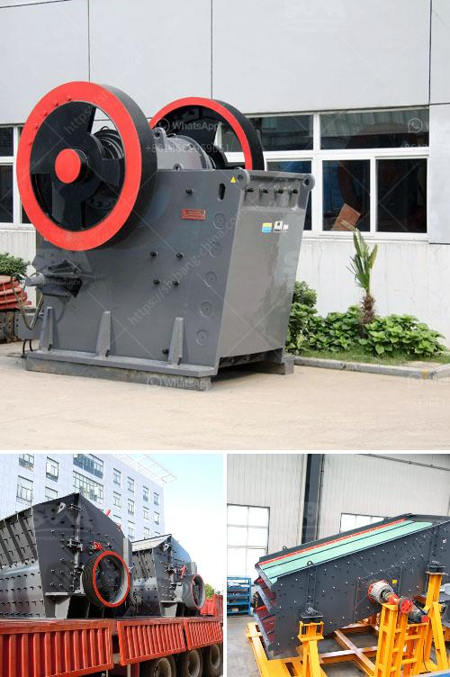

<h3>size of balls in ball mill</h3>
The size of the balls in a ball mill significantly affects the mill's efficiency and grinding capabilities. The smaller the ball size, the higher the surface area-to-volume ratio, and therefore, the faster the grinding process occurs. In addition, smaller balls enable more accurate shape and size distribution, thus ensuring consistent grinding performance throughout the milling process.

Conversely, larger balls require more force to cause impact and generate the desired grinding action. This results in slower milling rates and potentially reduced efficiency. Moreover, the larger balls can restrict the movement of the smaller balls within the mill, decreasing the overall grinding effectiveness.

The size of the balls also influences the final product fineness. Finer particles require more grinding time and energy, which can be achieved by using smaller balls. These smaller balls ensure a higher number of collision events, promoting a more thorough and efficient grinding process. On the other hand, larger balls may be preferred when coarse grinding is desired or when dealing with a more robust and less brittle material.

It is worth noting that the ball size should be carefully selected based on the specific milling goals and the nature of the material being processed. Factors such as material hardness, brittleness, desired particle size distribution, and even the mill's design parameters should be taken into consideration.

Overall, the size of the balls in a ball mill is an essential factor determining efficient grinding performance. The right combination of ball size can enhance milling rates, improve product quality, and reduce energy consumption. Determining the optimal ball size requires considering various factors and striking a balance between grinding efficiency and desired product characteristics.
<h3>Contact us</h3><ul><li><strong>Whatsapp:&nbsp;<a href="https://wa.me/8613661969651">+8613661969651</a></strong></li><li><a href="https://swt.shibang-china.com/?git&amp;zhl&amp;size of balls in ball mill"><strong>Online Service(chat now)</strong></a></li></ul><h3>Related</h3><ul><li><a href='gold ore processing equipment manufacturer india.md'>gold ore processing equipment manufacturer india</a></li><li><a href='metal conveyor belts in plates.md'>metal conveyor belts in plates</a></li><li><a href='stone crushing plant electro plants.md'>stone crushing plant electro plants</a></li><li><a href='what is cost for putting up a 2500 tpd cement plant.md'>what is cost for putting up a 2500 tpd cement plant</a></li><li><a href='cement plant limestone crusher details.md'>cement plant limestone crusher details</a></li></ul>