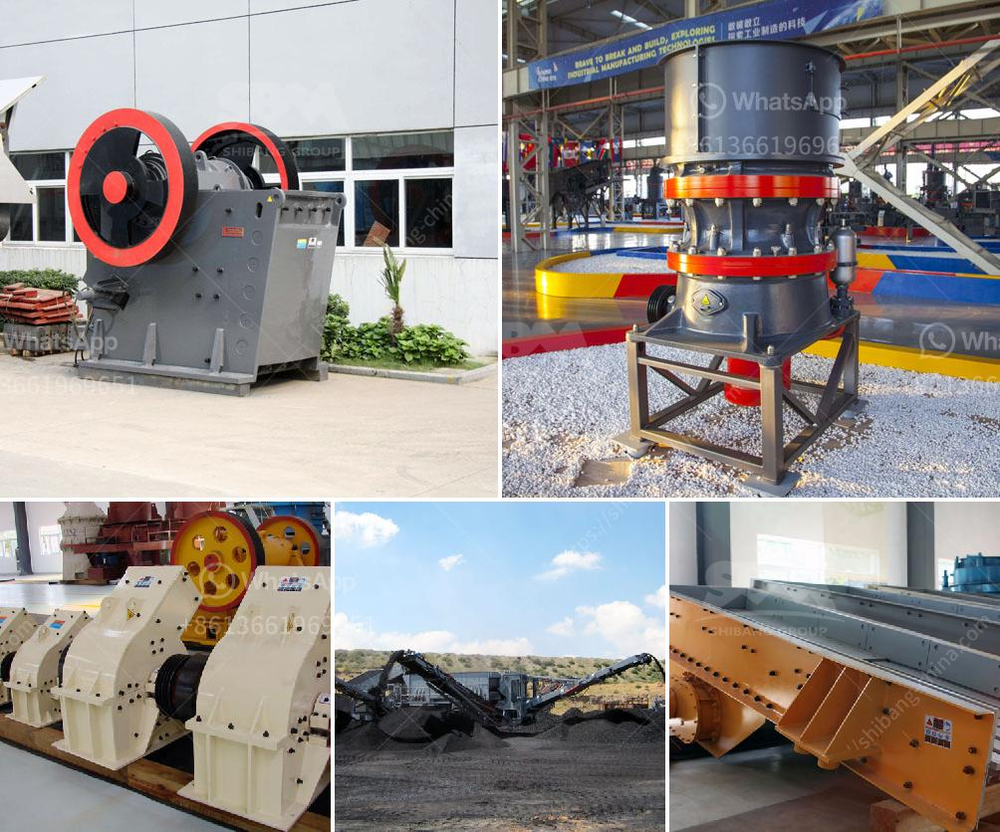

<h3>slag crusher machine kenya</h3>
Slag, a by-product of steel and iron production, is a complex mixture of silicates and oxides which is formed when these metals are smelted or refined. Slag can be found in various industries, including waste incineration, power plants, steel mills, and chemical plants. It is often considered as waste material with no significant value. However, with the development of technology, slag can now be recycled and used in various applications, making it a valuable resource.

One of the essential machines in slag recycling is the slag crusher machine, which reduces the size of the slag to smaller particles, allowing for better disposal and reduced transportation costs. Slag crusher machines also help in recovering valuable metal from the waste, which is then utilized in various industries such as steel, cement, and fertilizers.

The growing demand for metal chips prompted the development of slag crushers which are capable of separating the metal from the unwanted materials and enable efficient metal recovery. In Kenya, where steel and iron industries are experiencing a boom, the slag crusher machine is widely used in the recycling of slag.

At BMPL, we have developed a range of slag crushing machines with the highest quality components to ensure utmost precision and efficiency. Our machines can effortlessly crush the slag into smaller pieces that are convenient for recycling and further processing.

One of the key features of our slag crusher machines is its ability to produce uniform crushed particles. This is achieved through the use of a high-speed rotor that ensures optimal crushing of the slag. The crushed slag can then be used in various applications such as producing concrete, asphalt, and road base materials.

Another advantage of our slag crusher machine is its modular design, allowing for easy maintenance and replacement of parts. This ensures minimal downtime and increased productivity. The machine is also equipped with safety features to protect operators and maintain optimal working conditions.

The use of a slag crusher machine in Kenya is creating employment opportunities for many locals who are involved in the process of recycling and transforming waste slag into useful materials. These workers have become skilled in the safe and efficient handling of slag, which has resulted in improved working conditions and increased productivity.

Furthermore, the recycling of slag helps in reducing environmental pollution and conserving natural resources. By reusing the slag, we can minimize the need for quarrying and mining operations, which have detrimental effects on the environment. The use of slag crusher machines in Kenya also helps in reducing the carbon footprint since the recycling process eliminates the need for additional energy-intensive production processes.

In conclusion, the slag crusher machine in Kenya is a valuable resource for the steel and iron industry. By breaking down slag, it can be recycled, enabling industries to recover valuable metals and efficiently dispose of the waste. Additionally, the use of these machines helps in reducing environmental pollution and conserving natural resources, making it a win-win situation for both industries and the environment.
<h3>Contact us</h3><ul><li><strong>Whatsapp:&nbsp;<a href="https://wa.me/8613661969651">+8613661969651</a></strong></li><li><a href="https://swt.shibang-china.com/?git&amp;zhl&amp;slag crusher machine kenya"><strong>Online Service(chat now)</strong></a></li></ul><h3>Related</h3><ul><li><a href='raymond roller mill drawings.md'>raymond roller mill drawings</a></li><li><a href='jaw crusher machine for sale.md'>jaw crusher machine for sale</a></li><li><a href='quarry and mining crusher equipment.md'>quarry and mining crusher equipment</a></li><li><a href='density of balls for mills.md'>density of balls for mills</a></li><li><a href='cost of setting up a mini cement plant in india.md'>cost of setting up a mini cement plant in india</a></li></ul>