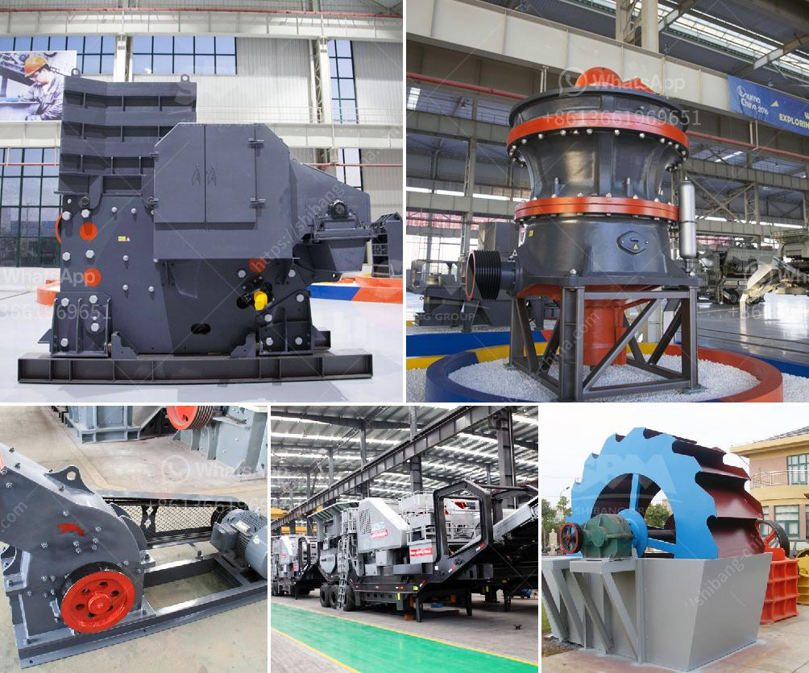

<h3>slag grinding machine</h3>
Slag is perhaps the most complicated and complex of all industrial waste products. It is discharged in a molten state through abrupt air cooling and often contains metallic iron and traces of metal elements. This metal content in slag is harmful to the environment and can lead to various environmental problems.

To solve the problem of slag disposal, many industries have turned to slag grinding machines, which can effectively crush and grind the slag into small pieces. The slag grinding machine, also known as slag vertical roller mill, is mainly used in the steel slag grinding production line.

The grinding process of the slag grinding machine is: the motor drives the reducer to rotate through the belt, and the reducer drives the rolling plate to rotate through the vertical line on the main rocker. The raw slag particles will be fed into the vertical roller mill through the feeding hopper on the side of the screen machine. The slag is sent to the grinding disc of the grinding machine through the screw conveyor. Under the action of centrifugal force, the material moves to the periphery of the grinding disc and enters the grinding zone. The material is crushed by the grinding roller on the grinding disc, and the slag powder is blown by the hot air blown into the mill through the nozzle ring. Finely ground particles are collected by the powder concentrator and transported to the final product silo through the conveying equipment. Oversized particles will be re-ground.

1. Energy-saving: The t energy consumption of the slag grinding machine is only 30% to 40% of that of the ball mill. This is because the vertical roller mill takes the principle of grinding material layer counterattack grinding and has a strong grinding ability.

2. Low noise: The noise of the slag grinding machine is 20 to 25 dB lower than that of the ball mill. In addition, due to the high temperature and heavy load operation, the salt water circulation heat dissipation mode is adopted, which can prevent the bearing bush from breaking due to high temperature.

3. Wide application range: The slag grinding machine can be equipped with a drying system and a powder concentrator, which can simultaneously grind and dry materials with moisture content up to 15%. It can also grind materials with a hardness value of 6-8 Mohs, such as slag, limestone, dolomite, etc.

4. Environmental protection: The slag grinding machine has a high dust collection efficiency and a dust concentration of less than 50mg/m³, which meets the national emission standards. The silencer is installed at the air inlet, and the mill body and silencer are connected with a pulse dust collector to reduce noise and dust pollution.

In conclusion, the slag grinding machine is an ideal equipment for grinding slag. It is widely used in steel plants, cement plants, and non-ferrous metal ore grinding fields. It has been praised by users for its many advantages such as high grinding efficiency, wide application range, and low noise. The development of slag grinding machines will provide a good solution for the comprehensive utilization of industrial waste and promote sustainable development in various industries.
<h3>Contact us</h3><ul><li><strong>Whatsapp:&nbsp;<a href="https://wa.me/8613661969651">+8613661969651</a></strong></li><li><a href="https://swt.shibang-china.com/?git&amp;zhl&amp;slag grinding machine"><strong>Online Service(chat now)</strong></a></li></ul><h3>Related</h3><ul><li><a href='limestone processing plant in benin.md'>limestone processing plant in benin</a></li><li><a href='sand crushing machine.md'>sand crushing machine</a></li><li><a href='pf series impact crusher.md'>pf series impact crusher</a></li><li><a href='concrete crushing machines.md'>concrete crushing machines</a></li><li><a href='cone crusher supplier.md'>cone crusher supplier</a></li></ul>