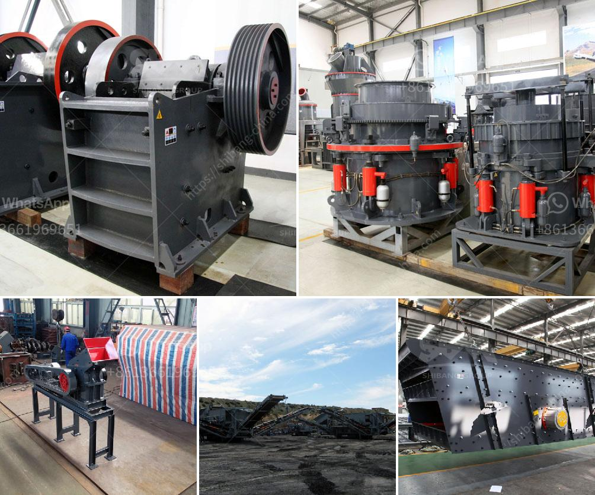

<h3>slag grinding problems</h3>
Slag is a by-product generated during the manufacturing of pig iron and steel. It is produced when molten slag, a mixture of iron ore fluxes and coke ash, is rapidly cooled to form a glass-like material. Slag is a valuable resource that can be used in various applications, such as road construction, cement production, and as a component in concrete. However, the process of grinding slag into a fine powder can pose several challenges and problems.

One of the main issues with slag grinding is the generation of excessive heat. During the grinding process, the friction between the steel balls and the slag particles generates a significant amount of heat, which can lead to a rise in temperature. This increase in temperature can cause the grinding equipment to overheat and may affect the quality of the ground slag. High temperatures can also result in the production of gases, such as sulfur dioxide, which can be harmful to the environment.

Another problem associated with slag grinding is the formation of coatings on the grinding equipment. As the slag particles break down during the grinding process, they can adhere to the surfaces of the grinding equipment, forming a coating or buildup. This coating can reduce the efficiency of the grinding equipment and impede the proper grinding of the slag particles. It can also cause uneven grinding, leading to variations in the particle size distribution of the ground slag.

Furthermore, the hardness of slag can be a challenge for grinding operations. Due to its glassy nature, slag can have a high degree of hardness, making it difficult to grind to the desired fineness. This can result in increased energy consumption and longer grinding times. Additionally, the presence of impurities in the slag, such as iron oxide or silica, can further increase its hardness, leading to additional challenges during grinding.

To overcome these problems, several strategies can be employed in slag grinding operations. Cooling systems can be implemented to control the temperature rise during grinding, ensuring that the equipment operates within safe limits. Proper maintenance of the grinding equipment, including regular cleaning and inspection, can also help prevent the formation of coatings and ensure efficient grinding.

In terms of hardness, the use of appropriate grinding media can significantly improve the grinding efficiency. For example, using steel balls with a higher hardness can help break down the slag particles more effectively. Additionally, the addition of grinding aids, such as glycerin or triethanolamine, can improve the flow properties of the slag and reduce its hardness, resulting in easier grinding.

In conclusion, while slag grinding offers significant economic and environmental benefits, it is not without its challenges. The generation of excessive heat, the formation of coatings, and the hardness of slag can pose problems during the grinding process. However, with proper equipment maintenance, cooling systems, and the use of appropriate grinding media and additives, these issues can be mitigated, leading to efficient and effective slag grinding operations.
<h3>Contact us</h3><ul><li><strong>Whatsapp:&nbsp;<a href="https://wa.me/8613661969651">+8613661969651</a></strong></li><li><a href="https://swt.shibang-china.com/?git&amp;zhl&amp;slag grinding problems"><strong>Online Service(chat now)</strong></a></li></ul><h3>Related</h3><ul><li><a href='coarse powder grinding mill.md'>coarse powder grinding mill</a></li><li><a href='stone crusher design.md'>stone crusher design</a></li><li><a href='ball mill ball feeders.md'>ball mill ball feeders</a></li><li><a href='diatomaceous earth processing machinery.md'>diatomaceous earth processing machinery</a></li><li><a href='cconveyor belts class.md'>cconveyor belts class</a></li></ul>