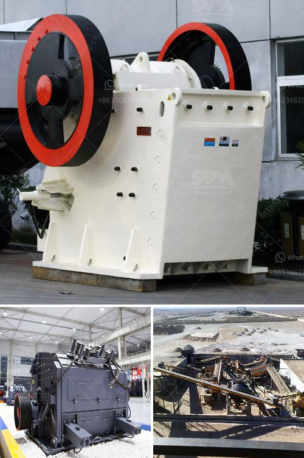

<h3>slag processing plant in india</h3>
India is a rapidly developing country with a large amount of industrial investment and production. With this growth comes the generation of various types of waste products, including slag – a byproduct of the metallurgical industry. Slag is a molten mass composed of impurities that are separated from metal during the smelting and refining process. 

To effectively manage and utilize slag generated in the industrial sector, India has established several slag processing plants in various regions. These plants ensure that the slag produced by various industries is processed and converted into valuable materials that can be used in various applications, minimizing environmental impact and promoting resource conservation.

One prominent example of a slag processing plant in India is the Fantomneel Metal Recovery Plant located in Haldia, West Bengal. This plant specializes in processing ferrochrome slag, a byproduct of the production of ferrochrome, an essential alloy used in stainless steel production. The plant has a capacity of processing 30,000 tonnes of slag per year, making it a crucial facility in the region for handling and managing this waste product.

The Fantomneel Metal Recovery Plant employs state-of-the-art technology to process the slag and extract valuable materials. The primary focus is on recovering chromium, iron, and other metal content from the slag, which can then be reused in various industries. This approach not only reduces the burden on natural resources but also decreases the environmental footprint associated with the extraction of these metals from their primary sources.

The processing of slag in this plant involves a series of steps that ensure effective separation and recovery of valuable materials. First, the slag is crushed into smaller particles to enhance the efficiency of the recovery process. Then, the crushed slag undergoes a magnetic separation process, which allows for the separation of ferrous and non-ferrous metals. The metals are further processed to remove impurities and obtain high-quality materials for reuse. The remaining non-metallic portion of the slag is transformed into construction materials, such as aggregates and sand, which can be used in infrastructure projects, reducing the need for extracting virgin materials from natural sources.

The establishment of slag processing plants in India has numerous benefits. Firstly, it helps to reduce the environmental impact of industrial activities by ensuring proper disposal and recycling of waste materials. Secondly, it promotes resource conservation by recovering valuable metals from slag that can be reused in various industries. This reduces the dependence on primary sources of these metals, which are often limited and non-renewable. Moreover, the processing of slag generates employment opportunities, contributing to the overall socio-economic development of the region.

In conclusion, slag processing plants in India play a critical role in managing and utilizing the waste generated by the metallurgical industry. These plants employ advanced technology to recover valuable metals and transform the remaining slag into construction materials. By reducing environmental impact, promoting resource conservation, and creating employment opportunities, these plants contribute to India's sustainable development goals.
<h3>Contact us</h3><ul><li><strong>Whatsapp:&nbsp;<a href="https://wa.me/8613661969651">+8613661969651</a></strong></li><li><a href="https://swt.shibang-china.com/?git&amp;zhl&amp;slag processing plant in india"><strong>Online Service(chat now)</strong></a></li></ul><h3>Related</h3><ul><li><a href='malaysia used conveyor belt for sale.md'>malaysia used conveyor belt for sale</a></li><li><a href='purchase of cement crusher machines.md'>purchase of cement crusher machines</a></li><li><a href='crushing plant for irion ore.md'>crushing plant for irion ore</a></li><li><a href='cost of graphite beneficiation plant.md'>cost of graphite beneficiation plant</a></li><li><a href='quartz grinding unit sale in nigeria.md'>quartz grinding unit sale in nigeria</a></li></ul>