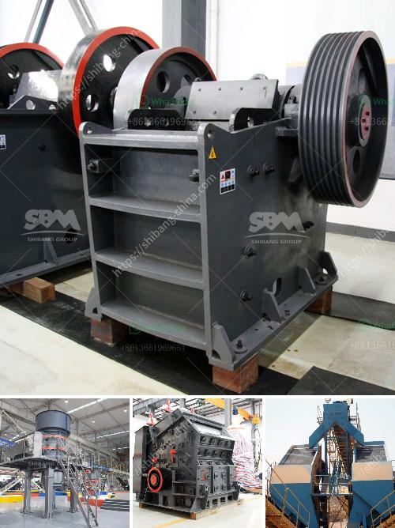

<h3>slag processing plant price in ghana</h3>
Slag, a by-product of industrial processes such as smelting and steel manufacturing, has long been considered as waste material. However, with advancements in technology, it is now recognized as a valuable resource that can be utilized in various industries. Ghana, a country rich in natural resources and a growing industrial sector, has also recognized the potential of slag and is investing in slag processing plants to unlock its economic benefits.

Slag processing plants are designed to recover valuable metals from the waste material and convert it into reusable products, such as aggregates and cementitious materials. These plants use sophisticated technology and equipment to process the slag, ensuring maximum recovery of valuable elements and minimal harm to the environment.

One of the key factors that influence the price of a slag processing plant in Ghana is the type and quality of equipment used in the plant. Advanced equipment with higher efficiency and productivity often comes with a higher price tag. However, investing in quality equipment is crucial as it ensures optimal performance and long-term cost-effectiveness. Additionally, the level of automation and control systems implemented in the plant can also affect the price. Highly automated plants with advanced control systems tend to have a higher upfront cost but offer increased operational efficiency and reduced labor requirements over time.

Another factor influencing the price is the capacity of the plant. The larger the capacity, the higher the initial investment required. However, a plant with a larger capacity can process a higher volume of slag, resulting in greater revenue generation. Therefore, it is essential to carefully assess the expected slag generation from industries in Ghana and project future demands to determine the appropriate capacity of the plant.

In addition to the initial investment, there are ongoing operational costs associated with running a slag processing plant. These costs include electricity, water, raw material supply, and maintenance. The availability of these resources and their associated costs in Ghana will influence the overall operational expenses.

Furthermore, government policies and regulations can impact the price of a slag processing plant in Ghana. Governments that actively promote the use of slag for various applications, such as road construction and cement production, often provide incentives and subsidies to encourage investments in slag processing. These incentives can help offset the initial capital investment and make the plant more affordable for businesses.

Overall, the price of a slag processing plant in Ghana depends on various factors, including the type and quality of equipment, the capacity of the plant, operational costs, and government policies. It is essential for businesses to conduct a detailed cost analysis and consider the potential revenue generation from selling processed slag products to make an informed investment decision.

Investing in a slag processing plant can bring numerous benefits to both the environment and the economy of Ghana. By converting waste materials into reusable products, the plant contributes to resource conservation and reduces the strain on natural resources. Additionally, the processed slag can be sold as valuable commodities, generating revenue and creating job opportunities. Therefore, the price of a slag processing plant should be seen as an investment rather than a cost, considering the long-term economic and environmental advantages it offers.
<h3>Contact us</h3><ul><li><strong>Whatsapp:&nbsp;<a href="https://wa.me/8613661969651">+8613661969651</a></strong></li><li><a href="https://swt.shibang-china.com/?git&amp;zhl&amp;slag processing plant price in ghana"><strong>Online Service(chat now)</strong></a></li></ul><h3>Related</h3><ul><li><a href='mining jaw crusher pe.md'>mining jaw crusher pe</a></li><li><a href='list of quarrying companies in the philippines.md'>list of quarrying companies in the philippines</a></li><li><a href='cost to setup cement plant industry.md'>cost to setup cement plant industry</a></li><li><a href='crushing plant for irion ore.md'>crushing plant for irion ore</a></li><li><a href='italia crusher machine.md'>italia crusher machine</a></li></ul>