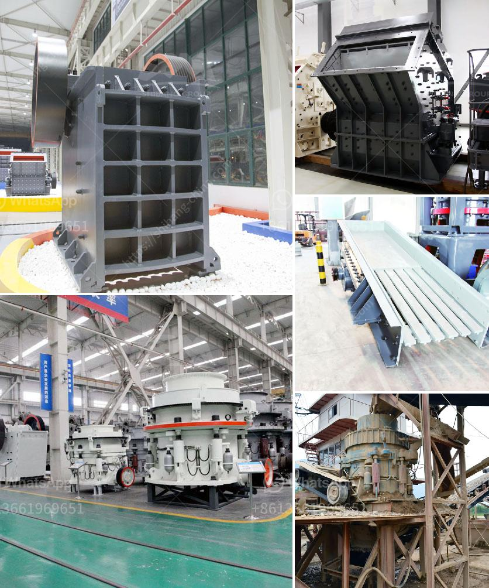

<h3>slag quarry equipments supplies in algeria</h3>
Algeria, located at the heart of North Africa, is a country with enormous potential. Its diverse landscapes, rich natural resources, and strategic geographical position make it an attractive destination for investments and economic development. One of the sectors that holds great promise for Algeria is the mining industry, specifically the extraction and processing of slag.

Slag, a byproduct of the steel manufacturing process, is a versatile material used in various industries, including construction, road building, and cement production. With the right equipment and supplies, slag can be effectively and efficiently processed, creating a valuable resource that can contribute to Algeria's economic growth.

However, the lack of modern quarry equipment and supplies has been a major hurdle in realizing the full potential of the slag industry in Algeria. Many existing quarries rely on outdated machinery and technologies, leading to low productivity, high operating costs, and suboptimal resource utilization. This not only hampers the growth of the slag industry but also limits the overall economic development of the country.

To address this issue, investment in modern quarry equipment and supplies is crucial. State-of-the-art crushers, screens, separators, and storage facilities can significantly improve the efficiency and output of slag processing plants. These advanced technologies reduce energy consumption, minimize waste, and ensure the production of high-quality slag products that meet international standards.

Furthermore, investing in the local production of quarry equipment and supplies presents an opportunity for Algeria to bolster its domestic manufacturing sector. By establishing manufacturing facilities for quarry equipment, Algeria can reduce its dependency on imports, create jobs, and stimulate economic growth. This would not only benefit the slag industry but also have a ripple effect on other sectors, such as steel manufacturing and construction.

In addition, Algeria's abundant natural resources, such as limestone and granite, make it an ideal location for the production of quarry equipment. By harnessing its own resources and promoting local manufacturing, Algeria can become a regional hub for high-quality quarry equipment, supplying both domestic and foreign markets. This would not only generate revenue but also enhance Algeria's reputation as an industrial and manufacturing powerhouse.

To make this vision a reality, collaboration between the public and private sectors is crucial. The Algerian government should provide incentives and support for investments in quarry equipment manufacturing, such as tax breaks, infrastructure development, and streamlined bureaucratic processes. On the other hand, private companies should seize this opportunity and invest in research and development, innovation, and skills training to ensure the production of world-class quarry equipment.

In conclusion, Algeria's slag industry has immense potential for economic growth. By investing in modern quarry equipment and supplies, Algeria can increase the efficiency and productivity of slag processing, create employment opportunities, and stimulate the local manufacturing sector. This will not only benefit the slag industry but also contribute to the overall economic development of the country. With the right strategic vision, Algeria can position itself as a leading player in the global quarry equipment market, attracting investments and driving sustainable growth for years to come.
<h3>Contact us</h3><ul><li><strong>Whatsapp:&nbsp;<a href="https://wa.me/8613661969651">+8613661969651</a></strong></li><li><a href="https://swt.shibang-china.com/?git&amp;zhl&amp;slag quarry equipments supplies in algeria"><strong>Online Service(chat now)</strong></a></li></ul><h3>Related</h3><ul><li><a href='used stone crusher plant for sale andhra pradesh.md'>used stone crusher plant for sale andhra pradesh</a></li><li><a href='stone crusher company india mastro.md'>stone crusher company india mastro</a></li><li><a href='mobile concrete crusher trailer mounted.md'>mobile concrete crusher trailer mounted</a></li><li><a href='diatomaceous earth processing machinery.md'>diatomaceous earth processing machinery</a></li><li><a href='ball grinding machine in india.md'>ball grinding machine in india</a></li></ul>