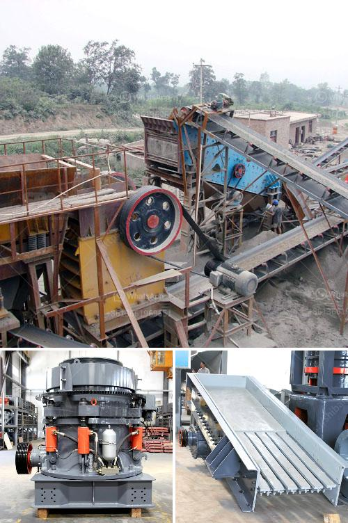

<h3>small aggregate washer plants</h3>
Small aggregate washer plants are a vital tool for any construction or mining site that deals with sand, gravel, or crushed stone. These plants help clean and separate the aggregates, ensuring they meet the required specifications for use in various applications such as concrete production, road construction, or landscaping.

One of the key advantages of small aggregate washer plants is their compact size. These plants are specifically designed to be portable and easy to transport, making them ideal for smaller operations or sites with limited space. Despite their compact size, they offer excellent efficiency and performance, tackling the washing and separation process with ease.

The main function of a small aggregate washer plant is to remove impurities and fines from the aggregates. The plant is equipped with a high-pressure water pump that sprays water onto the aggregates, effectively scrubbing them clean. The water, along with the debris and fines, is then collected in a settling pond or tank, where the solids settle to the bottom and the water is recycled for reuse in the washing process.

In addition to cleaning the aggregates, small aggregate washer plants also help separate them based on size. The plant is equipped with screens or classifiers that sort the aggregates into different sizes or gradations. This ensures that each size of aggregate is used appropriately, maintaining the quality and consistency of the final product.

The versatility of small aggregate washer plants is another noteworthy feature. They can handle a wide range of materials, including all types of sand, gravel, crushed stone, or even recycled concrete. This makes them suitable for various projects and industries, allowing users to efficiently process aggregates for different applications.

In conclusion, small aggregate washer plants are an essential tool for any site dealing with aggregates. Their portable and compact design, along with their ability to clean and separate various materials, makes them an indispensable asset for construction and mining operations of all sizes. The use of these washer plants ensures that the aggregates are clean, properly graded, and ready for use, thus contributing to the success of any project.
<h3>Contact us</h3><ul><li><strong>Whatsapp:&nbsp;<a href="https://wa.me/8613661969651">+8613661969651</a></strong></li><li><a href="https://swt.shibang-china.com/?git&amp;zhl&amp;small aggregate washer plants"><strong>Online Service(chat now)</strong></a></li></ul><h3>Related</h3><ul><li><a href='standard operating procedures for cone crusher.md'>standard operating procedures for cone crusher</a></li><li><a href='stone crusher sale lease.md'>stone crusher sale lease</a></li><li><a href='quarry crusher equipment for sale brisbane.md'>quarry crusher equipment for sale brisbane</a></li><li><a href='best mill for wet grinding of calcium carbonate.md'>best mill for wet grinding of calcium carbonate</a></li><li><a href='vertical roller mill industrial.md'>vertical roller mill industrial</a></li></ul>