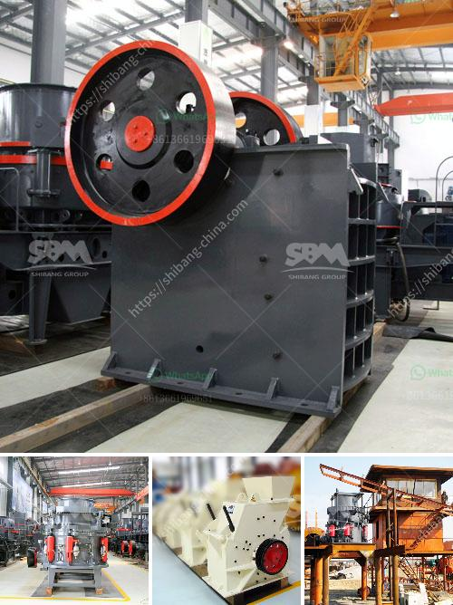

<h3>small cement grinding plant</h3>
A small cement grinding plant is a vital piece of equipment for any construction business. Having a compact and reliable grinding station allows for quick and efficient grinding of cement powder. This plant can produce high-quality cement for various projects, enabling builders to meet their deadlines and deliver exceptional results.

The small cement grinding plant typically consists of a vertical grinding mill and a classifier, which are housed in a compact structure. These small plants are simple to install and maintain, ensuring minimal downtime and maximum productivity. With their compact size, they can be easily transported to different construction sites, providing flexibility and convenience.

One of the key advantages of a small cement grinding plant is its efficiency. The grinding mill is designed to crush and grind the cement clinker to a fine powder, which can then be used to produce high-quality cement. The small plant is designed with advanced technology and precision engineering, ensuring that each grinding process produces consistent and uniform results.

Moreover, this small plant is cost-effective, making it an ideal choice for small to medium-sized construction businesses. Its compact design eliminates the need for a large infrastructure investment, reducing capital expenditure. Additionally, the plant's energy-efficient operation helps to minimize operating costs, lowering overall production expenses.

Furthermore, a small cement grinding plant can be easily upgraded to increase its capacity as the business grows. This scalability allows construction companies to start with a smaller plant and expand it gradually to meet the increasing demand for cement.

In conclusion, a small cement grinding plant is an essential asset for construction businesses. Its compact size, efficiency, cost-effectiveness, and upgradability make it a valuable investment. With a small cement grinding plant, builders can ensure the production of high-quality cement and deliver outstanding results to their clients.
<h3>Contact us</h3><ul><li><strong>Whatsapp:&nbsp;<a href="https://wa.me/8613661969651">+8613661969651</a></strong></li><li><a href="https://swt.shibang-china.com/?git&amp;zhl&amp;small cement grinding plant"><strong>Online Service(chat now)</strong></a></li></ul><h3>Related</h3><ul><li><a href='made for conveyor belts in uae.md'>made for conveyor belts in uae</a></li><li><a href='talc production process.md'>talc production process</a></li><li><a href='marble grinding machine price.md'>marble grinding machine price</a></li><li><a href='products lm vertical grinding mills.md'>products lm vertical grinding mills</a></li><li><a href='clay ceromic manufacturing process.md'>clay ceromic manufacturing process</a></li></ul>