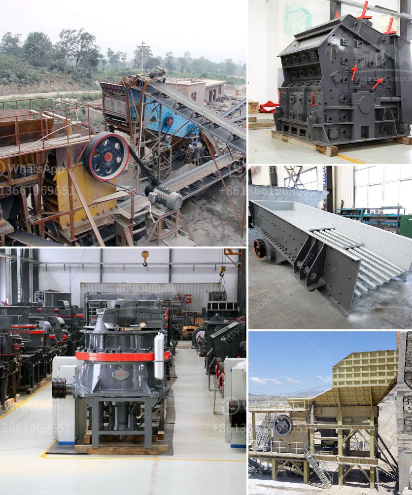

<h3>small concrete crusher for sale</h3>
If you are in the construction or mining industry, chances are you need to break down big pieces of concrete into smaller sizes for various projects. In such cases, a small concrete crusher proves to be an essential piece of equipment. These machines enable you to quickly and efficiently crush concrete into manageable sizes, making it easier to transport and work with. For those in search of a small concrete crusher for sale, we have got you covered.

A small concrete crusher, also known as a mini crusher, is designed to break down old concrete and rubble into smaller pieces. These machines are compact and portable, meaning they can be easily transported and used on various job sites. The small size also ensures that the crusher can be maneuvered easily and can be operated even in tight spaces.

One of the main advantages of a small concrete crusher is its versatility. It can be used for a wide range of applications, from demolishing concrete structures to recycling concrete waste. Whether you need to crush concrete slabs, walls, or foundations, a small concrete crusher can handle the task.

Another key feature of a small concrete crusher is its ease of use. Most models come with easy-to-operate controls and require minimal training to operate. They are also equipped with safety features to prevent accidents and ensure operator protection. Additionally, these crushers are low maintenance and have fewer moving parts, making them relatively simple to maintain and repair.

In terms of cost, a small concrete crusher for sale is a cost-effective solution for projects that require smaller quantities of crushed concrete. It eliminates the need for costly transportation and disposal fees, as you can crush the concrete on-site and use it for immediate construction purposes.

In conclusion, if you are in need of a small concrete crusher for sale, it is important to consider its size, versatility, ease of use, and cost-effectiveness. By investing in a reliable mini crusher, you can efficiently crush concrete and save money on transportation and disposal fees.
<h3>Contact us</h3><ul><li><strong>Whatsapp:&nbsp;<a href="https://wa.me/8613661969651">+8613661969651</a></strong></li><li><a href="https://swt.shibang-china.com/?git&amp;zhl&amp;small concrete crusher for sale"><strong>Online Service(chat now)</strong></a></li></ul><h3>Related</h3><ul><li><a href='china cement grinding unit manufacturers.md'>china cement grinding unit manufacturers</a></li><li><a href='hammer mill for clay.md'>hammer mill for clay</a></li><li><a href='stone crusher machine company.md'>stone crusher machine company</a></li><li><a href='calcium carbonate processing plant price.md'>calcium carbonate processing plant price</a></li><li><a href='small scale crushing plant.md'>small scale crushing plant</a></li></ul>