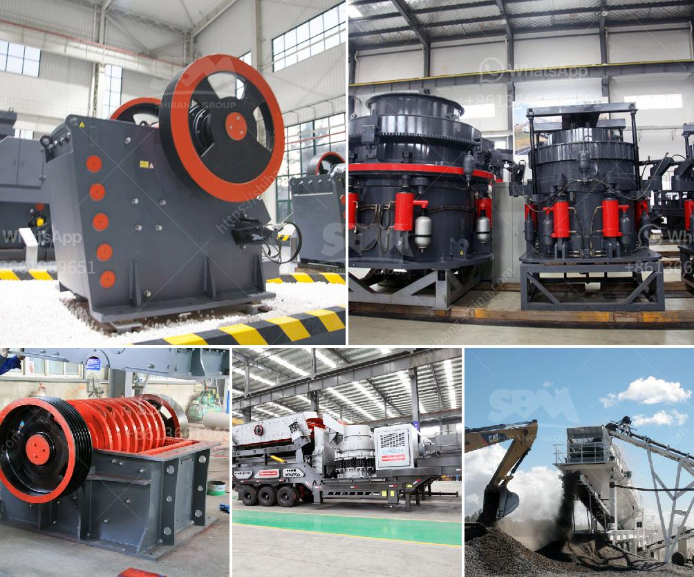

<h3>small crusher malaysia</h3>
In the industrial sector, crushers play a vital role in various applications, including mining, construction, and recycling. However, not all projects require large, heavy-duty crushers. Sometimes, the need arises for a compact and efficient solution that can deliver excellent results without occupying too much space. This is where small crushers come into the picture, and Malaysia offers a wide range of options in this category.

Small crushers are suitable for various crushing tasks, including demolition, mining, and recycling. They are versatile machines that can handle different types of materials, such as concrete, asphalt, and bricks. These crushers are compact in size, making them easy to transport and maneuver in confined working conditions. Whether it's a construction site with limited space or a remote location where mobility is crucial, small crushers in Malaysia provide a convenient solution.

One popular type of small crusher is the jaw crusher. As the name suggests, it works by crushing materials between a fixed jaw and a moving jaw. This mechanism allows for efficient and precise crushing, ensuring that the desired size of the crushed material is achieved. Jaw crushers are suitable for a wide range of applications, from primary crushing to secondary crushing and even tertiary crushing.

Another type of small crusher commonly found in Malaysia is the impact crusher. Unlike jaw crushers, impact crushers use impact force to break down materials. This makes them ideal for applications where the goal is to create cubical-shaped particles. Crushed materials can be used for various purposes, such as road base, concrete aggregate, and landscaping.

Small crushers in Malaysia are equipped with advanced features to enhance productivity and user-friendliness. They are often equipped with hydraulic systems for easy adjustment of the crusher settings and overload protection. Some models also feature onboard screens, allowing for the production of multiple end products without the need for additional equipment.

In conclusion, small crushers offer a versatile and compact solution for various crushing needs. Whether it's for demolition, mining, or recycling, these machines can effectively crush different materials while occupying minimal space. Malaysia provides a range of options when it comes to small crushers, including jaw crushers and impact crushers. Regardless of the choice, these crushers are packed with features to ensure optimal performance and user satisfaction.
<h3>Contact us</h3><ul><li><strong>Whatsapp:&nbsp;<a href="https://wa.me/8613661969651">+8613661969651</a></strong></li><li><a href="https://swt.shibang-china.com/?git&amp;zhl&amp;small crusher malaysia"><strong>Online Service(chat now)</strong></a></li></ul><h3>Related</h3><ul><li><a href='micro powder grinding mill prices.md'>micro powder grinding mill prices</a></li><li><a href='supplier of conveyor belt kenya.md'>supplier of conveyor belt kenya</a></li><li><a href='complete stone quarry plant.md'>complete stone quarry plant</a></li><li><a href='ball mill manufacturer in india.md'>ball mill manufacturer in india</a></li><li><a href='bauxite crusher design.md'>bauxite crusher design</a></li></ul>