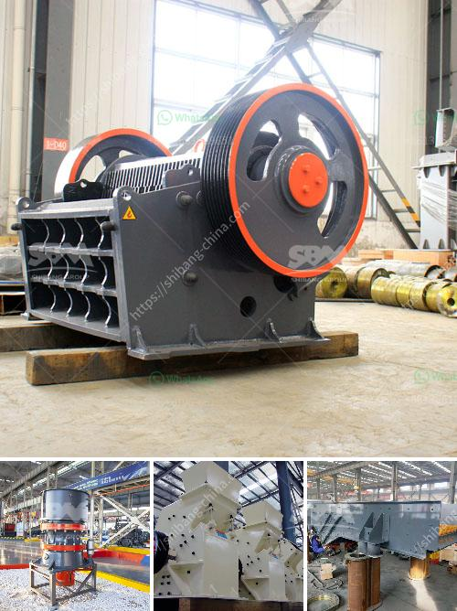

<h3>small mechanical jaw crusher singapore</h3>
Singapore is a thriving and dynamic city-state with a population of more than 5 million people. This bustling urban center attracts millions of visitors every year, making it a major hub for tourism, commerce, and trade. However, as with any highly developed city, construction activities inevitably lead to the generation of waste materials.

One of the key challenges in waste management is the disposal of construction debris. As infrastructure and building projects continue to boom in Singapore, the demand for aggregates such as sand and stone increases. This poses a significant problem as the traditional methods of crushing and disposing of construction waste involve huge costs and are not environmentally friendly.

In recent years, a small mechanical jaw crusher, also known as a mini jaw crusher, has gained popularity in Singapore. Designed to be efficient, reliable, and cost-effective, this compact stone crushing equipment uses hydraulic pressure and can efficiently reduce large rocks into smaller rocks or gravel.

The motor-driven small jaw crusher is used by contractors and demolition teams who want to recycle concrete, paving stones, and other construction waste materials. The machine, in its compact size, is highly efficient and can fit through narrow access points, making it ideal for urban construction sites.

With its low noise emissions and dust suppression system, the small mechanical jaw crusher is considered an environmentally friendly solution. It reduces air pollution by preventing the release of harmful dust particles and reduces noise pollution, allowing construction activities to continue uninterrupted in residential areas.

Moreover, the small jaw crusher in Singapore is portable, allowing construction workers to easily transport it from one site to another. This versatility reduces transportation costs and optimizes efficiency at construction sites.

A significant advantage of the small mechanical jaw crusher is its ability to offer adjustable settings. Depending on the desired final product size, construction workers can adjust the machine to achieve the optimal crushing output. This flexibility ensures that different types of construction waste, such as concrete, bricks, and asphalt, can be processed efficiently.

Additionally, the small mechanical jaw crusher minimizes the need for manual labor. With its automated crushing process, construction workers can focus on other crucial tasks. This helps increase productivity and reduces the risk of work-related injuries.

The use of small mechanical jaw crushers in Singapore has proven to be a cost-effective and sustainable solution for stone crushing. As the city continues to develop, the demand for aggregates will continue to rise. By utilizing this innovative equipment, construction companies can efficiently process construction waste and contribute to Singapore's sustainability goals.

In conclusion, the small mechanical jaw crusher in Singapore serves as a valuable asset in the construction industry. It offers a cost-effective and environmentally friendly solution for stone crushing, enabling the efficient recycling of construction waste materials. As Singapore continues to grow and develop, using this innovative equipment will play a vital role in meeting its infrastructure needs while ensuring a greener and more sustainable future.
<h3>Contact us</h3><ul><li><strong>Whatsapp:&nbsp;<a href="https://wa.me/8613661969651">+8613661969651</a></strong></li><li><a href="https://swt.shibang-china.com/?git&amp;zhl&amp;small mechanical jaw crusher singapore"><strong>Online Service(chat now)</strong></a></li></ul><h3>Related</h3><ul><li><a href='coal crusher suppliers.md'>coal crusher suppliers</a></li><li><a href='mobile gypsum crusher.md'>mobile gypsum crusher</a></li><li><a href='stone hammer mill.md'>stone hammer mill</a></li><li><a href='hammer mills in harare zimbabwe.md'>hammer mills in harare zimbabwe</a></li><li><a href='crushers for rent cincinnati.md'>crushers for rent cincinnati</a></li></ul>