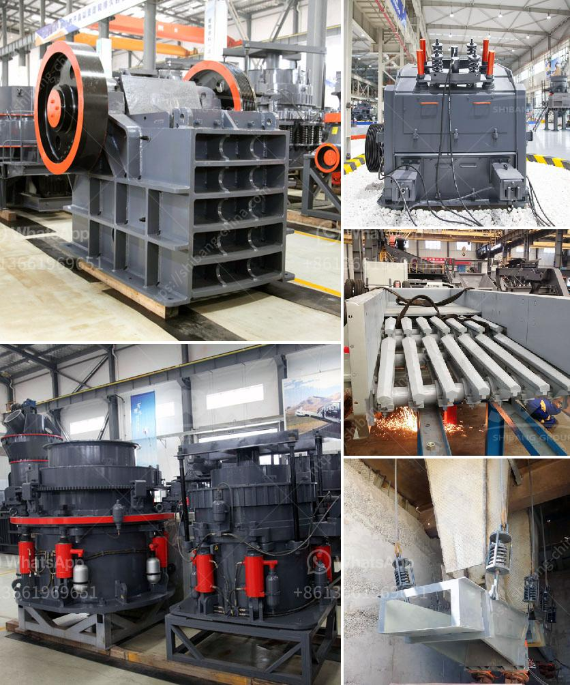

<h3>small mobile diesel engine double rolls crusher</h3>
In the ever-expanding global mining industry, advancements in technology are crucial to keeping up with competition. A small mobile diesel engine double rolls crusher is a compact and portable option that provides a cost-effective solution for crushing different types of materials. This crusher utilizes two rolls, one fixed and one movable, to achieve a superior reduction ratio and uniform particle size.

One of the main advantages of a small mobile diesel engine double rolls crusher is its portability. It can be easily transported to different job sites, allowing for flexibility and convenience. This is especially beneficial in mining operations where material needs to be crushed on-site or in remote locations. The compact size also ensures that it can be easily maneuvered even in narrow spaces or confined areas.

The crusher is equipped with a small diesel engine, which provides power for the rolls and also serves as a generator for powering other equipment on-site. This eliminates the need for external power sources, making the crusher suitable for use in areas with limited infrastructure or access to electricity. The diesel engine offers excellent fuel efficiency, reducing operating costs and environmental impact.

The double rolls design of the crusher ensures a precise and controlled reduction of materials. The adjustable gap between the rolls allows for fine-tuning the output size, making it possible to produce various sizes of crushed material. This versatility is a significant advantage as it allows for the production of different aggregates or materials for specific applications.

The crusher is designed to handle a wide range of materials, including ores, minerals, coal, and other aggregates. Its sturdy construction and durable components ensure reliable performance even in demanding and harsh environments. The rolls are made of high-quality steel and are designed to withstand heavy-duty applications, reducing wear and maintenance requirements.

In addition to its primary crushing function, the small mobile diesel engine double rolls crusher can also facilitate the screening process. By incorporating a screen deck after the rolls, the crusher can separate the fines from the larger particles. This improves the efficiency of downstream processes and reduces the need for additional screening equipment.

Overall, a small mobile diesel engine double rolls crusher offers a cost-effective and efficient solution for crushing and screening needs in mining and construction industries. Its portability, versatility, and durability make it an ideal option for various applications. Whether it is used for primary or secondary crushing, this crusher ensures high performance and optimal productivity. With its compact size and diesel engine power, it is designed to adapt to different working conditions and deliver consistent results.
<h3>Contact us</h3><ul><li><strong>Whatsapp:&nbsp;<a href="https://wa.me/8613661969651">+8613661969651</a></strong></li><li><a href="https://swt.shibang-china.com/?git&amp;zhl&amp;small mobile diesel engine double rolls crusher"><strong>Online Service(chat now)</strong></a></li></ul><h3>Related</h3><ul><li><a href='conveyor belt manufacturer in indonesia and philippines.md'>conveyor belt manufacturer in indonesia and philippines</a></li><li><a href='chrome processing and drying.md'>chrome processing and drying</a></li><li><a href='price list of washing of rock phosphate.md'>price list of washing of rock phosphate</a></li><li><a href='construction hammer mill.md'>construction hammer mill</a></li><li><a href='crushing media liner manufacturers.md'>crushing media liner manufacturers</a></li></ul>