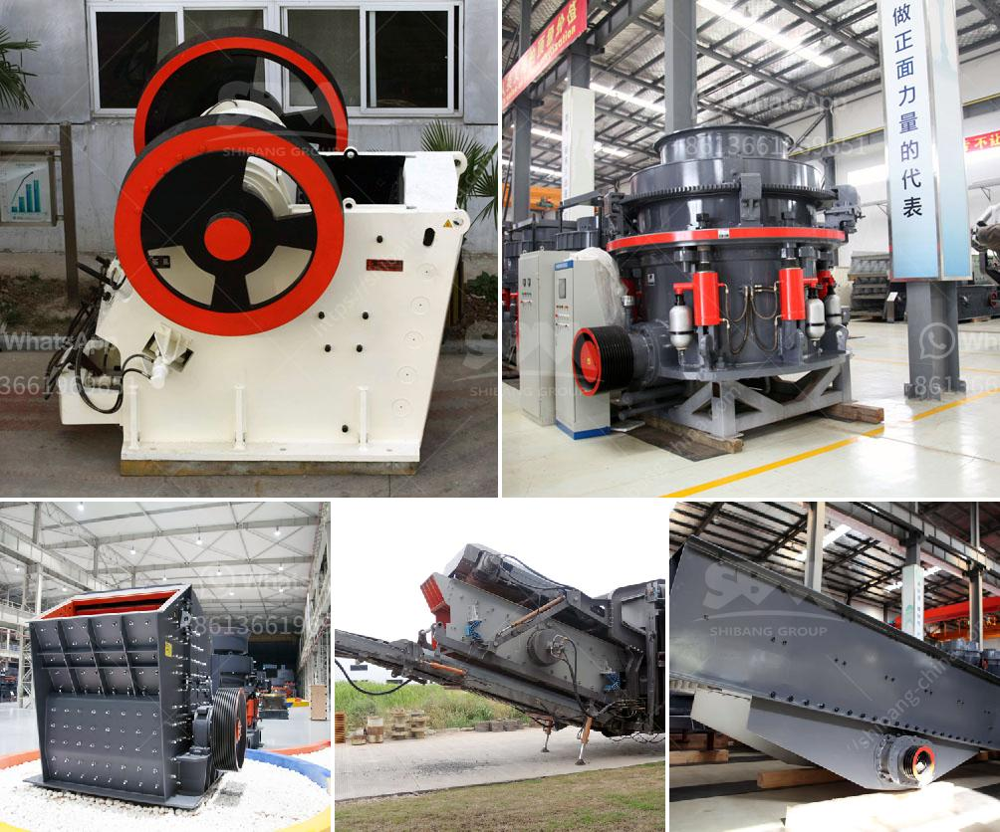

<h3>small motor ore crusher for home</h3>
For those who enjoy trying their hand at home projects, a small motor ore crusher is a must-have tool. This versatile device allows you to crush and pulverize various types of ores and rocks, right at home. Whether you are a DIY enthusiast, a hobbyist, or a small-scale miner, this equipment can significantly simplify the process of extracting valuable minerals.

One of the key advantages of a small motor ore crusher is its compact size. Designed to be lightweight and portable, it can easily fit on a countertop or workbench. This means you don't need a large space or a dedicated workshop to benefit from this handy tool. You can conveniently crush small batches of ore without the need for heavy machinery or professional assistance.

Despite its compact size, these crushers are equipped with a powerful motor that ensures efficient crushing results. The motor is specifically designed to handle the demands of crushing dense ores, reducing them into fine particles for further processing. With this reliable motor, you can break down various materials, including quartz, granite, and even harder minerals, with ease.

The small motor ore crusher also comes with adjustable settings, allowing you to adjust the size of the output particles. This feature is particularly useful when you need to crush ores for specific purposes, such as creating jewelry, researching geological samples, or processing material for smelting. Additionally, the crusher's compact design ensures minimal vibration and noise, making it a pleasant and user-friendly tool to operate.

In terms of safety, manufacturers have taken precautions to ensure that these crushers are safe for home use. They incorporate safety features like a protective shield and a reliable emergency stop button, giving users peace of mind while operating the equipment.

In conclusion, a small motor ore crusher is an essential tool for home use, providing a convenient and efficient solution for crushing various types of ores. Its compact size, powerful motor, and adjustable settings make it a versatile tool that can meet the needs of DIY enthusiasts, hobbyists, and small-scale miners. With its ease of use and safety features, this crusher ensures a hassle-free and enjoyable crushing experience at home.
<h3>Contact us</h3><ul><li><strong>Whatsapp:&nbsp;<a href="https://wa.me/8613661969651">+8613661969651</a></strong></li><li><a href="https://swt.shibang-china.com/?git&amp;zhl&amp;small motor ore crusher for home"><strong>Online Service(chat now)</strong></a></li></ul><h3>Related</h3><ul><li><a href='roll mill machine.md'>roll mill machine</a></li><li><a href='metal conveyor belts malaysia.md'>metal conveyor belts malaysia</a></li><li><a href='industrial vibrating screen price.md'>industrial vibrating screen price</a></li><li><a href='crushing machine in philippines.md'>crushing machine in philippines</a></li><li><a href='supplier of conveyor belt kenya.md'>supplier of conveyor belt kenya</a></li></ul>