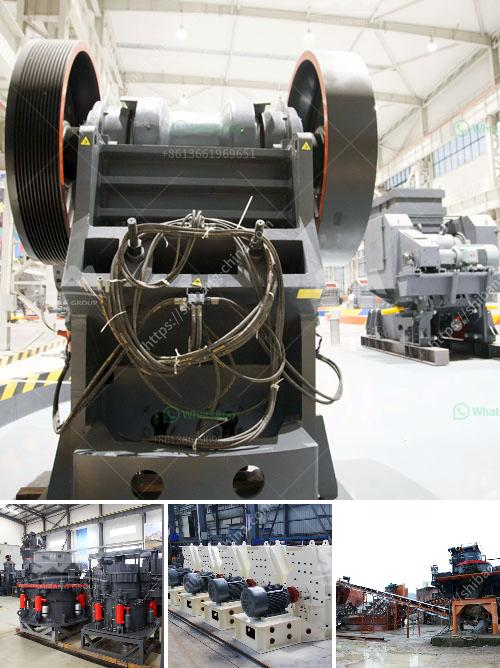

<h3>small portable concrete crusher</h3>
When structures made of concrete are demolished or renovated, concrete recycling is an increasingly common method of utilizing the rubble. Concrete was once routinely trucked to landfills for disposal, but recycling has a number of benefits that have made it a more attractive option in this age of environmental awareness.

One method of recycling concrete is by using a portable concrete crusher, which is small in size and can be moved to any location within a project site. Portable crushers can be used on site to break down and recycle concrete and asphalt for reuse as construction aggregate. These portable crushers can be mounted on wheels or on tracks, making them easily transportable to different job sites. This flexibility allows contractors to take advantage of the cost savings and environmental benefits of recycling concrete and asphalt, even in remote locations.

One of the key advantages of a small portable concrete crusher is its ability to move around the job site quickly. This mobility eliminates the need for transportation of crushed materials, which can significantly reduce costs and save time. It also allows contractors to use the crusher on multiple project sites without the need to dismantle and reassemble the equipment. This not only saves time but also ensures that the crusher is readily available whenever it is needed.

In addition to its mobility, a small portable concrete crusher also offers a compact design, making it easier to maneuver and operate on tight job sites. This compactness allows the crusher to be used in small spaces, such as narrow alleys or indoor spaces, where larger crushers may not be able to fit. This versatility makes a small portable concrete crusher suitable for a wide range of applications, from residential construction to commercial demolition.

Another significant advantage of using a portable concrete crusher is its environmental impact. Concrete recycling reduces the need for new materials, such as gravel and sand, which are typically extracted from natural resources. By reusing concrete and asphalt, less waste is sent to landfills, reducing the strain on limited landfill space. Additionally, the process of crushing and recycling concrete generates less dust and noise compared to traditional demolition methods, which benefits workers and the surrounding community.

In conclusion, a small portable concrete crusher offers many advantages for contractors involved in demolition or renovation projects. Its mobility, compact design, and environmental benefits make it a valuable tool for recycling concrete and asphalt on-site. By choosing to use a portable concrete crusher, contractors can both save money and contribute to a more sustainable construction industry.

Whether it is a small residential project or a large commercial site, a portable concrete crusher is a practical and efficient solution for breaking down and recycling concrete and asphalt. With its low maintenance requirements and ease of operation, it is a valuable addition to any construction project's equipment lineup.
<h3>Contact us</h3><ul><li><strong>Whatsapp:&nbsp;<a href="https://wa.me/8613661969651">+8613661969651</a></strong></li><li><a href="https://swt.shibang-china.com/?git&amp;zhl&amp;small portable concrete crusher"><strong>Online Service(chat now)</strong></a></li></ul><h3>Related</h3><ul><li><a href='lime manufacturing process.md'>lime manufacturing process</a></li><li><a href='grinding mill for limestone upto 2 microns.md'>grinding mill for limestone upto 2 microns</a></li><li><a href='300kg to 500kg ball mill.md'>300kg to 500kg ball mill</a></li><li><a href='chrome processing and drying.md'>chrome processing and drying</a></li><li><a href='roller mill for mantles.md'>roller mill for mantles</a></li></ul>