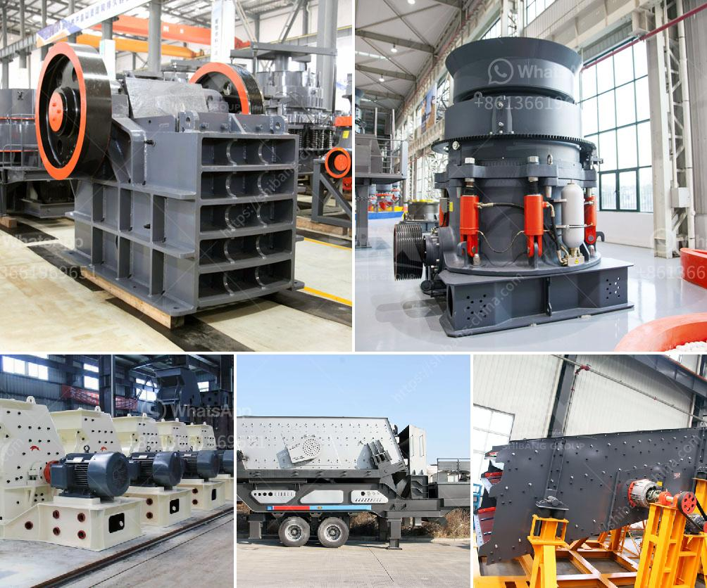

<h3>small scale crushers in south africa</h3>
Small scale mining is an essential activity in many African countries as it provides an opportunity for livelihood, particularly in rural areas. In such communities, artisanal miners work in a rudimentary and often informa Tech SolutionsATISed sector, using rudimentary tools and equipment. Consequently, they face numerous health and safety risks, not only to themselves but also to the surrounding environment. To address these challenges, innovative and appropriate technologies are urgently needed. One such technology is the small scale crusher in South Africa.

Crushers enable the effective recycling of materials, reducing the environmental footprint and transmission of disease within communities. They have the capacity to recycle construction waste and concrete into reusable building materials and are therefore particularly useful to small scale miners. Crushers are also efficient for reducing the size and volume of materials before further processing. This allows for easier separation of valuable minerals, reducing the overall processing time and cost.

There are several types of crushers available in the market that work in a similar manner. They have a fixed plate and a movable plate, which causes the material to be crushed. Crushers can be utilized in mining, construction, and recycling industries. These industries are highly dependent on strong crushers that are able to break down larger rocks into smaller aggregates to be used in construction.

The small scale crushers specifically intended for mining works offer an efficient and affordable way to break down all types of mined rocks, including conglomerates, as well as minerals like gold and copper. Crushers ensure efficient breaking of material, reducing energy consumption and improving efficiency in the subsequent processes.

Small scale crushers also serve a wide range of application needs with productions ranging from 3-25 tons per hour. Highly customizable in terms of design, installation, and configuration, they can efficiently handle any required production. Many mineral processing plants and mines experience maintenance problems with traditional crusher types. To address this problem, different types of crushers were designed specifically for mining applications.

The crushers are built to withstand the demanding requirements of mining operations and are incredibly durable. Ensuring continuous operation with minimal downtime, these crushers are designed to be reliable and long-lasting. With a compact design, they can be easily transported to remote sites, making them perfect for small scale miners in South Africa.

Additionally, the crushers are also designed with a safety aspect in mind. Integrated with a crusher overload protection system, these machines ensure safety to prevent damage to the equipment or excessive wear of the crushing surfaces. Crushers are also equipped with a reliable lubrication system, greatly reducing the risk of unexpected breakdowns and maintenance delays.

Renowned for their simplicity and reliability, small scale crushers provide significant benefits to small scale miners in South Africa. These crushers are designed and built with advanced technology and stringent quality control at every stage of the manufacturing process, ensuring that they are durable and safe to use.

In conclusion, small scale crushers in South Africa play a significant role in the improvement of artisanal miners’ lives and communities. Crushers help liberate valuable minerals from rocks and ores, offering an alternative to traditional mining methods. Thus, they contribute to reducing poverty and promoting sustainable development in South Africa.
<h3>Contact us</h3><ul><li><strong>Whatsapp:&nbsp;<a href="https://wa.me/8613661969651">+8613661969651</a></strong></li><li><a href="https://swt.shibang-china.com/?git&amp;zhl&amp;small scale crushers in south africa"><strong>Online Service(chat now)</strong></a></li></ul><h3>Related</h3><ul><li><a href='used coal washing plant sale.md'>used coal washing plant sale</a></li><li><a href='china vibrating screen.md'>china vibrating screen</a></li><li><a href='construction debris recycling.md'>construction debris recycling</a></li><li><a href='china jaw crusher pe 150 250 in philippines.md'>china jaw crusher pe 150 250 in philippines</a></li><li><a href='about aggregate crusher plants.md'>about aggregate crusher plants</a></li></ul>