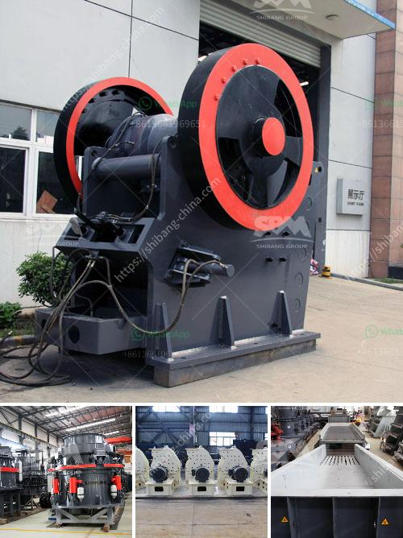

<h3>small scale crushing plant</h3>
There are numerous reasons why you should consider investing in a small-scale crushing plant. The level of flexibility and efficiency is fantastic in addition to the fact that it offers a lot of convenience to users. Besides, among all the other benefits, it also helps reduce the cost of production significantly, making it an ideal choice for small-scale miners.

Small-scale crushing plants offer many relative benefits towards the quarrying industry. Flexibility and ease of use are regarded as the two main factors to ensure success. Both of these factors, along with many other benefits that can be attained from small-scale crushing plants, can lead to the ultimate higher return on investment. But how is it possible for these small-scale crushing plants to make such a big impact on the mining industry?

First and foremost, small-scale crushers possess a compact structure, which is unfavorable to the establishment of large-scale concentrators. They need a small amount of space and can be easily transported from one place to another. This eliminates the need for costly and time-consuming relocation. With the convenience in transportation and installation, the operational cost of this type of crushing plant is highly reduced.

Additionally, small-scale crushing plants provide high-energy efficiency and significant labor-saving features. It eliminates the need for mine haul trucks that generate additional operating costs. Instead, the material is directly loaded onto a conveyor belt, bypassing the need for heavy machinery consistently moving back and forth. This swift and efficient process limits energy consumption and the emission of greenhouse gases, contributing positively to environmental sustainability.

Moreover, small-scale crushers produce small-sized aggregates, better suited for use in a variety of applications. These include the construction of roads, bridges, and buildings. The small-scale crushers also help reduce the volume of waste generated from mining operations, which is an essential aspect to consider in today's environmentally conscious world.

Furthermore, small-scale crushing plants have the ability to crush the tough and hard materials (such as rocks and stones) into small-sized gravel and sand. This flexibility allows for various mining activities to be undertaken without overcommitting financially to large-scale crushing plants, which are expensive to run and maintain.

In a nutshell, small-scale crushing plants are a game-changer in the mining industry. They offer a cost-effective alternative to the large-scale crushing plants, which require huge investments. Moreover, small-scale crushing plants are flexible enough to handle different types of materials, ensuring maximum productivity and profitability for the mining operations.

Investing in a small-scale crushing plant is a smart and economical choice. It can help you boost your mining business revenue, increase production output, and guarantee steady growth. With the right plant selection and proper management, small-scale crushing plants can be a game-changer in achieving sustainable mining operations.
<h3>Contact us</h3><ul><li><strong>Whatsapp:&nbsp;<a href="https://wa.me/8613661969651">+8613661969651</a></strong></li><li><a href="https://swt.shibang-china.com/?git&amp;zhl&amp;small scale crushing plant"><strong>Online Service(chat now)</strong></a></li></ul><h3>Related</h3><ul><li><a href='small stone crusher price in india.md'>small stone crusher price in india</a></li><li><a href='stone mill grinder for sale.md'>stone mill grinder for sale</a></li><li><a href='bentonite plant german.md'>bentonite plant german</a></li><li><a href='stone crushing plant electro plants.md'>stone crushing plant electro plants</a></li><li><a href='dolomite powder making equipment.md'>dolomite powder making equipment</a></li></ul>