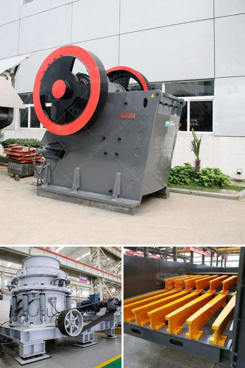

<h3>small scale gypsum powder production line</h3>
Gypsum powder has a wide range of applications, including construction materials, industrial molds, chemical industry, agriculture, and many others. In order to produce high-quality gypsum powder, a small scale gypsum powder production line is needed. In this article, we will focus on a small scale gypsum powder production line that consists of one or several gypsum powder mills, a rotary kiln, and a calciner.

The gypsum powder production line manufacturers are composed of several key components, such as crushing system, grinding system, calcining system, and packaging system. The gypsum powder production line mainly contains three procedures: crushing, grinding, and calcining.

Gypsum raw materials are crushed into small particles by jaw crusher, then the crushed materials are conveyed to a storage bin by the elevator. The materials are evenly and continuously fed into the mill through the vibrating feeder. After grinding, the gypsum powder is sent into the calcining chamber via the bucket elevator, and the calcining chamber is heated by natural gas or coal. The gypsum powder is calcined into semi-hydrated gypsum, and then sent to the finished product warehouse for packaging through the conveyor.

The small scale gypsum powder production line has a capacity ranging from 30 tons to 100 tons per day. The whole production line can be completed in a relatively short time, from raw material crushing to finished product packaging. This is an ideal choice for small and medium-sized enterprises.

1. High automation level: The production line is equipped with advanced PLC control system, which ensures the whole production process runs smoothly and efficiently.

2. Energy-saving and environmental-friendly: The production line adopts advanced technology and equipment, which can effectively reduce energy consumption and environmental pollution.

3. Cost-effective: The small scale gypsum powder production line has a relatively low investment cost, which is easy to operate, manage, and maintain. It can greatly reduce the production cost and improve the economic benefits.

4. Customized design: The small scale gypsum powder production line can be designed according to the specific requirements of customers, such as the production capacity, the raw materials, and the final product quality.

In conclusion, a small scale gypsum powder production line is a good choice for start-up businesses and small and medium enterprises. It is flexible and adaptable, with high automation level and low investment cost. With the continuous development of the gypsum powder industry, there will be more and more small scale gypsum powder production lines, which can bring great opportunities and benefits to entrepreneurs.
<h3>Contact us</h3><ul><li><strong>Whatsapp:&nbsp;<a href="https://wa.me/8613661969651">+8613661969651</a></strong></li><li><a href="https://swt.shibang-china.com/?git&amp;zhl&amp;small scale gypsum powder production line"><strong>Online Service(chat now)</strong></a></li></ul><h3>Related</h3><ul><li><a href='price of crusher machine for sale in nigeria.md'>price of crusher machine for sale in nigeria</a></li><li><a href='jaw crusher size specifications.md'>jaw crusher size specifications</a></li><li><a href='used crusher equipment south africa.md'>used crusher equipment south africa</a></li><li><a href='super fine powder grinder.md'>super fine powder grinder</a></li><li><a href='price of conveyor belts for mining.md'>price of conveyor belts for mining</a></li></ul>