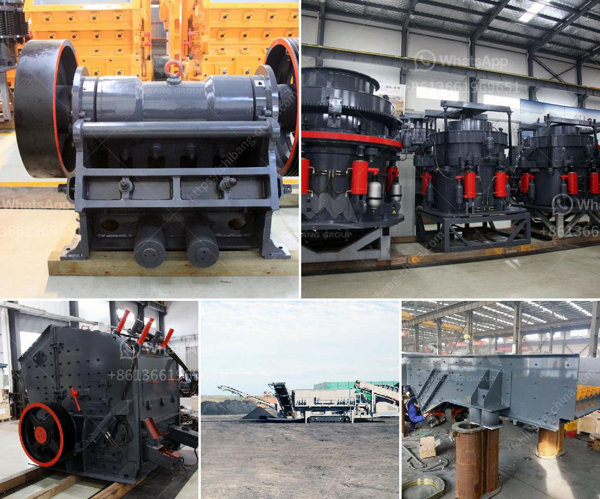

<h3>small scale industrial pulveriser</h3>
A pulveriser is a machine used in industrial settings to grind or crush materials into smaller particles. It is an essential tool in various industries, including construction, mining, and manufacturing. Small-scale industrial pulverisers are designed to cater to the needs of smaller businesses and individuals who require pulverising capabilities on a smaller scale. These machines offer numerous benefits and have become increasingly popular in recent years.

One of the key advantages of small-scale industrial pulverisers is their compact size. Unlike their larger counterparts, which require significant space and infrastructure, these machines can fit into smaller workspaces. This makes them ideal for small businesses with limited space or individuals working from home. Despite their smaller size, these pulverisers can still deliver impressive performance and produce high-quality pulverised materials.

Another advantage is their efficiency and versatility. Small-scale industrial pulverisers are designed to be efficient and effective in pulverising a wide range of materials, including plastics, chemicals, minerals, and food products. They can handle various particle sizes and have adjustable settings to achieve the desired output. This versatility allows businesses to cater to different customers' needs and expand their product offerings.

In addition to their compact size and versatility, small-scale industrial pulverisers are also cost-effective. They are generally more affordable than larger machines, making them a viable option for smaller businesses with limited budgets. Furthermore, they consume less power and require lower maintenance, resulting in reduced operational costs over time. This affordability allows businesses to invest in a high-quality pulverising solution without breaking the bank.

Furthermore, these pulverisers offer user-friendly operation and easy maintenance. They are built with simplicity in mind, making them easy to operate even for individuals with limited technical knowledge. Additionally, routine maintenance tasks are straightforward and can be easily performed by the user. This reduces downtime and increases productivity, allowing businesses to focus on their core operations instead of troubleshooting complex machinery issues.

Small-scale industrial pulverisers also contribute to sustainability and environmental friendliness. They are designed to be energy-efficient, reducing power consumption and carbon footprint. Additionally, they can handle various waste materials, such as plastics and food waste, and turn them into valuable pulverised products. This promotes a circular economy by reducing waste generation and providing opportunities for recycling and upcycling.

In conclusion, small-scale industrial pulverisers offer numerous advantages for businesses and individuals requiring pulverising capabilities on a smaller scale. Their compact size, versatility, cost-effectiveness, user-friendly operation, and environmental friendliness make them an attractive option for small businesses and individuals working from home. Investing in these machines can help businesses expand their product offerings, reduce operational costs, and contribute to a more sustainable future.
<h3>Contact us</h3><ul><li><strong>Whatsapp:&nbsp;<a href="https://wa.me/8613661969651">+8613661969651</a></strong></li><li><a href="https://swt.shibang-china.com/?git&amp;zhl&amp;small scale industrial pulveriser"><strong>Online Service(chat now)</strong></a></li></ul><h3>Related</h3><ul><li><a href='crushing plant layout.md'>crushing plant layout</a></li><li><a href='used crusher for sale in dubai.md'>used crusher for sale in dubai</a></li><li><a href='stone crushing machines south africa.md'>stone crushing machines south africa</a></li><li><a href='coal crusher machine 5 ton per hours.md'>coal crusher machine 5 ton per hours</a></li><li><a href='grinding machinery manufecture in africa.md'>grinding machinery manufecture in africa</a></li></ul>