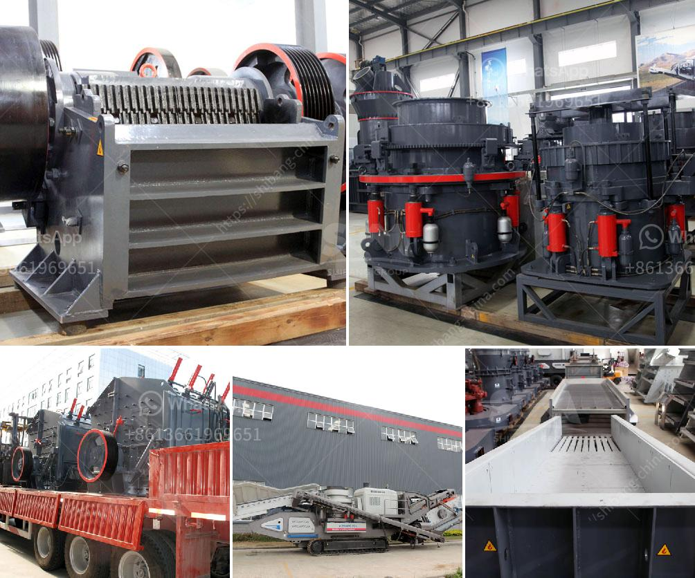

<h3>small scale stone crusher price list</h3>
In recent years, as the rapid development of mining industry, small scale stone crusher has been widely used in mining, metallurgy, construction, building materials and other industries. However, due to the lack of mining experience, many investors are hesitant to invest in small scale stone crusher. So how much is a small scale stone crusher? What factors influence its price?

The production capacity of a small scale stone crusher is related to the type and model of the machine. We have different models, such as PE150*250, PE250*400, PE400*600, PE500*750, PE600*900, PE750*1060, PE900*1200, etc. The capacity can range from 1-1000 tons per hour.

The hardness, moisture content and particle size of the processed materials will affect the production capacity and price of the small scale stone crusher. If the hardness is high, the wear resistance of the machine will be stronger and the price will be higher. If the moisture content is high, it may cause blockage during the crushing process, thus affecting the output.

The market demand for small scale stone crushers will also affect the price. If there is a large demand for this equipment, the price will be relatively high due to the tight supply. On the contrary, if the market demand is small, the price will be relatively low.

Different manufacturers will have different manufacturing processes, raw material selection, and production costs, which will directly affect the price. Well-known brands usually have higher prices due to their good reputation and high-quality after-sales service.

The distance between the small scale stone crusher and the production site also affects its price. If the distance is too far, the transportation costs will increase, resulting in higher costs.

In conclusion, there are various factors that can affect the price of a small scale stone crusher. It is recommended that investors choose the appropriate model according to their actual production needs and budget. Furthermore, it is advisable to choose a reputable manufacturer with reasonable prices and good after-sales service. By carefully considering these factors, investors can find the ideal small scale stone crusher at a reasonable price.
<h3>Contact us</h3><ul><li><strong>Whatsapp:&nbsp;<a href="https://wa.me/8613661969651">+8613661969651</a></strong></li><li><a href="https://swt.shibang-china.com/?git&amp;zhl&amp;small scale stone crusher price list"><strong>Online Service(chat now)</strong></a></li></ul><h3>Related</h3><ul><li><a href='portable sand screening machine philippines.md'>portable sand screening machine philippines</a></li><li><a href='granite crushing plant in sri lanka.md'>granite crushing plant in sri lanka</a></li><li><a href='gypsum production plant.md'>gypsum production plant</a></li><li><a href='basin a grinding roller mill.md'>basin a grinding roller mill</a></li><li><a href='ball mill suppliers for lead processing.md'>ball mill suppliers for lead processing</a></li></ul>