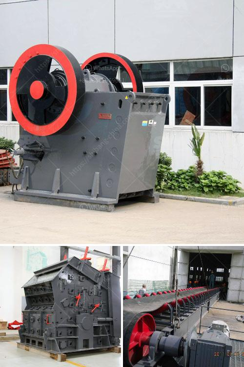

<h3>small shore sand suction dredger machine for sale</h3>
When it comes to dredging in shallow water areas, such as lakes, rivers, or small shorelines, a small shore sand suction dredger machine can be a valuable asset. These powerful machines are designed to remove sand, silt, and other sediments from the bottom of water bodies, improving water flow, preventing flooding, and maintaining navigational channels.

One of the benefits of a small shore sand suction dredger machine is its compact size. With a smaller footprint compared to larger dredgers, these machines can easily navigate through narrow waterways or confined spaces. They are also more cost-effective, making them an attractive option for smaller-scale projects with limited budgets.

These dredgers are equipped with powerful suction pumps that draw in sand and water from the bottom. The collected material is then transported through a pipeline to a designated discharge area, effectively de-watering the sediment as it travels. The dredger is designed to be easily operated by a single person, allowing for efficient and swift completion of dredging tasks.

The versatility of small shore sand suction dredger machines makes them ideal for various applications. They can be used for maintenance dredging in marinas or harbors, removing accumulated sediment to maintain safe depths for boats and ships. Additionally, these machines can also be utilized in beach restoration projects, where the deposited sand is pumped back onto eroded beaches, restoring their natural beauty and functionality.

If you are considering investing in a small shore sand suction dredger machine, there are various options available for sale. It is essential to choose a reputable supplier that offers high-quality equipment that meets your specific requirements. Look for dredgers that are built to withstand harsh conditions and have robust suction pumps to ensure efficient and reliable performance.

In conclusion, a small shore sand suction dredger machine is an invaluable tool for dredging in shallow water areas. Its compact size, cost-effectiveness, and versatility make it an excellent choice for a wide range of applications. By investing in this machine, you can maintain water flow, prevent flooding, and enhance the beauty and functionality of shorelines, harbors, and beaches.
<h3>Contact us</h3><ul><li><strong>Whatsapp:&nbsp;<a href="https://wa.me/8613661969651">+8613661969651</a></strong></li><li><a href="https://swt.shibang-china.com/?git&amp;zhl&amp;small shore sand suction dredger machine for sale"><strong>Online Service(chat now)</strong></a></li></ul><h3>Related</h3><ul><li><a href='crusher machine capacity 5 tons per hour.md'>crusher machine capacity 5 tons per hour</a></li><li><a href='ball mills price south africa.md'>ball mills price south africa</a></li><li><a href='but concrete crushers nigeria.md'>but concrete crushers nigeria</a></li><li><a href='metal conveyor belts in plates.md'>metal conveyor belts in plates</a></li><li><a href='propel mobile crusher.md'>propel mobile crusher</a></li></ul>