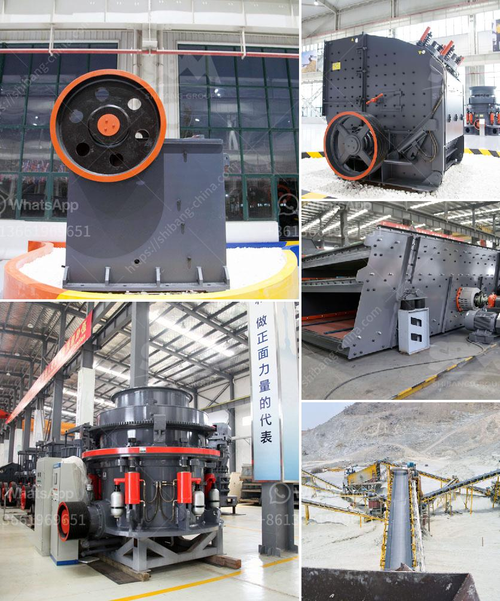

<h3>small stone crusher machine</h3>
Small stone crusher machines are designed for such small scale crushing plants. They are very affordable and they can easily be transported to remote locations. They are rugged, strong and durable as they are made from high-quality materials. These machines are capable of crushing different kinds of materials such as rocks, marbles, granite, iron ore, and copper ore.

This machine is used to break down large rocks into smaller pieces. These smaller pieces are then used for various purposes such as building roads, constructing buildings, or even for agricultural purposes. The machine is equipped with a powerful motor that ensures its high productivity. It can crush large chunks of stones within a short period of time.

The small stone crusher machine is also called mini crusher machine or small crushing machine, which is used in a wide range of industrial sectors. It is an indispensable equipment in the mining industry, especially for the jaw crusher. Jaw crusher is an important coal crusher machine, which is widely used in coal crushing production line.

The equipment used in the coal processing plant includes coal crushing and coal milling, coal pulverizer, belt conveyors, vibrating feeders, vibrating screens, and so on. In general, the high-quality coal is widely used in the metallurgical industry, chemical industry, power industry, and also in the cement industry and other industrial sectors. The coal crusher machine plays a great role in improving the utilization efficiency of coal resources.

Small stone crusher machines have many advantages, such as small footprint, less investment, and easy operation. They provide a good choice for clients who need urgent transportation to their project site. Small stone crusher machines are designed with compact structures, which make them portable and easy to transport. They are flexible and can be set up in a short period of time.

Small stone crusher machines are widely used in various sectors such as mining, construction, material recycling, and construction waste management. It is beneficial for the environment as it reduces the pollution caused by the disposal of waste materials. It is also cost-effective as it reduces the cost of transporting waste materials to landfills.

In conclusion, small stone crusher machines are essential equipment for producing high-quality aggregate materials for construction projects. They are particularly suitable for use in remote areas where transportation costs are high and access to natural resources is limited. These machines provide a cost-effective solution for crushing and recycling waste materials, contributing to a more sustainable and environmentally friendly construction industry.
<h3>Contact us</h3><ul><li><strong>Whatsapp:&nbsp;<a href="https://wa.me/8613661969651">+8613661969651</a></strong></li><li><a href="https://swt.shibang-china.com/?git&amp;zhl&amp;small stone crusher machine"><strong>Online Service(chat now)</strong></a></li></ul><h3>Related</h3><ul><li><a href='equipment for gold refinery.md'>equipment for gold refinery</a></li><li><a href='functions of the hammer mill.md'>functions of the hammer mill</a></li><li><a href='gypsum manufacturers in azerbaijan.md'>gypsum manufacturers in azerbaijan</a></li><li><a href='machine that to crush rock.md'>machine that to crush rock</a></li><li><a href='dust cover for screening and crushing plant.md'>dust cover for screening and crushing plant</a></li></ul>