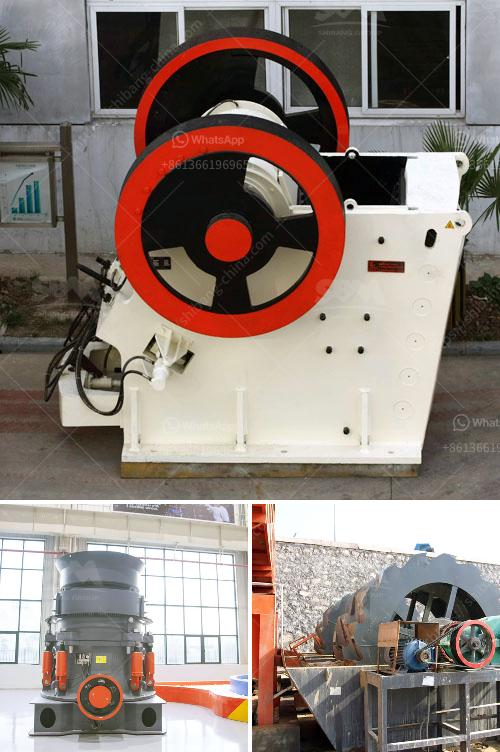

<h3>small stone crusher price in india</h3>
Small stone crusher has a wide range of application as mining equipment to crush hard gold ore, silver ore, iron ore, quartz stone, copper ore, marble and so on. The small stone crusher, as small-scale mining equipment, is of great importance for some small miners, as it is featured by low operation cost and easy operation.

In India, a large number of small stone crusher manufacturers are reliable and welcomed by the customers who want to purchase these small stone crusher machines. Whether small-scale mining or metallurgical industry, mining machinery manufacturers are everywhere. They provide all kinds of crushers, mills, sand making machines, and auxiliary equipment with high quality and low price.

Small stone crushers are primarily small scale industries mostly owned and operated by less educated individuals and are scattered all over the country. For small stone crushing operation, with the restriction of low investment cost, they can afford large new crushing equipment, and prefer the small and medium-sized crusher equipment. To buy a small stone crusher in India, it is necessary to choose a reliable manufacturers, and regional brand manufacturers can provide more excellent performance crushers. Generally, the price of small stone crusher in India is relatively low.

Compared with the large-scale stone crusher, the cost of a small stone crusher or rock crusher in India is relatively low. The production line has small footprint and small weight. It is suitable for crushing medium hard and brittle materials, especially for the materials with compressive strength not exceeding 150MPa.

The price of small stone crusher is influenced by many factors, such as manufacturer, crusher quality, production capacity, and even the suppliers. Different suppliers have different qualities of their products, and they also have different service levels. Therefore, when the customer decides to buy a small stone crusher, he must choose the right supplier to purchase the equipment.

In conclusion, small stone crusher price in India is relatively low, which is suitable for small-scale mining industry. If you want to find small stone crusher price or any other information, please contact us. We are glad to help you.
<h3>Contact us</h3><ul><li><strong>Whatsapp:&nbsp;<a href="https://wa.me/8613661969651">+8613661969651</a></strong></li><li><a href="https://swt.shibang-china.com/?git&amp;zhl&amp;small stone crusher price in india"><strong>Online Service(chat now)</strong></a></li></ul><h3>Related</h3><ul><li><a href='roll crusher zenith.md'>roll crusher zenith</a></li><li><a href='copper slag manufacturing process.md'>copper slag manufacturing process</a></li><li><a href='gypsum production line in spain for sale.md'>gypsum production line in spain for sale</a></li><li><a href='gypsum manufacturers in azerbaijan.md'>gypsum manufacturers in azerbaijan</a></li><li><a href='mobile coal crusher in philippines.md'>mobile coal crusher in philippines</a></li></ul>