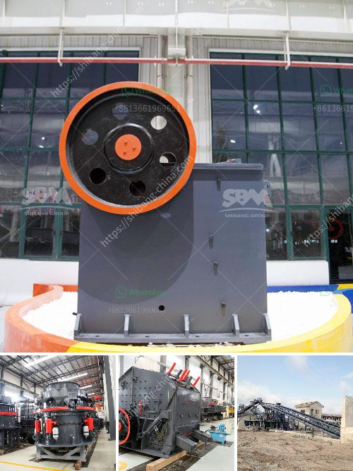

<h3>south africa mobile rock crusher</h3>
South Africa is known for its rich mining industry which has made it a hub for various mobile rock crushers. These rock crushers have revolutionized the way mines operate and they are becoming increasingly popular due to their ability to crush rocks into smaller, more manageable sizes.

Mobile rock crushers are capable of crushing rocks into different sizes as per the requirement. They are also equipped with the latest technology and are capable of crushing even the hardest of rocks. The mobility factor of these crushers makes them a perfect choice for remote mining sites where transportation can be a challenge.

One prominent mobile rock crusher manufacturer based in South Africa is a company called SRP, which specializes in the design and manufacture of crushing and screening equipment. The company has been in the business for more than 30 years and is a pioneer in the field of rock crushing.

Today, SRP has a wide range of mobile rock crushers to choose from. The company maintains a strong focus on delivering quality, reliable machines to its customers. These crushers are also easy to maintain and operate, making them a favorite choice for many mining operations.

Mobile rock crushers have been developed with the aim of saving time and energy for the mining industry. By crushing rocks on-site, miners can eliminate the need for transporting rocks to a central processing plant, thereby reducing transportation costs and saving time.

Additionally, these crushers are environmentally friendly, as they use less fuel compared to traditional crushers. This not only reduces carbon emissions but also contributes to a cleaner and greener mining industry.

In conclusion, mobile rock crushers have revolutionized the mining industry in South Africa. They provide an efficient and cost-effective solution to crushing rocks on-site, saving both time and money. With advancements in technology and a wide range of options available, these crushers are becoming increasingly popular among mining companies.
<h3>Contact us</h3><ul><li><strong>Whatsapp:&nbsp;<a href="https://wa.me/8613661969651">+8613661969651</a></strong></li><li><a href="https://swt.shibang-china.com/?git&amp;zhl&amp;south africa mobile rock crusher"><strong>Online Service(chat now)</strong></a></li></ul><h3>Related</h3><ul><li><a href='aggregate for cement block making.md'>aggregate for cement block making</a></li><li><a href='granite crusher manufacturer.md'>granite crusher manufacturer</a></li><li><a href='mobile crusher unit.md'>mobile crusher unit</a></li><li><a href='stone crusher in jos plateau state nigeria.md'>stone crusher in jos plateau state nigeria</a></li><li><a href='silica sand stone machine china.md'>silica sand stone machine china</a></li></ul>