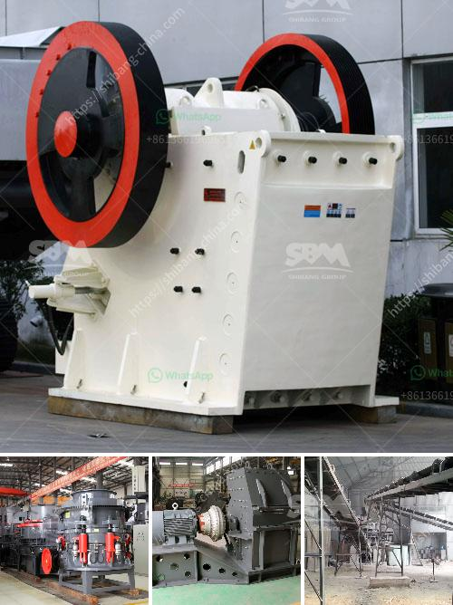

<h3>standard operating procedures for cone crusher</h3>
When it comes to the safe and efficient operation of a cone crusher, it is important to understand every aspect of its operation, from the basic principles to the method to prevent damages. Cone crushers are designed to crush hard and abrasive materials, and they are widely used in the mining and construction industry.

Before start-up, inspect all parts of the cone crusher, including fasteners, belts, electrical connections, safety guards, and fluid levels, and make sure there are no leaks or damages. Ensure that the protective guards are in place and securely fastened.

After the inspection, start the lubrication system and allow it to run for a few minutes to ensure proper lubrication of all parts. Check the oil level in the tank, oil in the sight gauge, and the oil temperature, which should not exceed 60°C (140°F). Also, make sure the filters are clean and free from obstructions.

Once the crusher is started, allow it to run empty for a short period to warm up the machine. This will help to ensure the proper functionality and reduce the risk of sudden failures. After the warm-up period, check all gauges on the control panel and ensure they are reading within the recommended operating range.

Next, set the crusher to the desired discharge size and start the feed conveyor. Adjust the speed of the conveyor to ensure a steady flow of material into the crusher. If the material starts to pile up, it may cause damage to the crusher or result in uneven particle sizes. Regularly monitor the feed rate and adjust it as needed to maintain a consistent flow.

During operation, pay close attention to the crusher's performance and the readings on the gauges. Abnormal sounds, vibrations, or excessive heat should be investigated immediately. If any issues are detected, stop the crusher and address the problem before resuming operation. Regular maintenance and inspection programs are crucial to identifying and resolving any potential problems early.

When shutting down the cone crusher, follow a similar procedure. Ensure that all material has been cleared from the crushing chamber, and then stop the conveyor belt and the crusher's motor. Finally, close all access doors and secure them in place to prevent any unwanted accidents.

In addition to these general procedures, it is important to consult the cone crusher's manual for any specific instructions or precautions that may apply to your equipment. Each manufacturer may have slightly different guidelines, and following them is essential to optimize the cone crusher's performance, lifespan, and safety.

In conclusion, understanding the standard operating procedures for a cone crusher is crucial for the safe and efficient operation of the equipment. By following these procedures and taking the necessary precautions, operators can reduce the risk of accidents and maintain the overall performance of the cone crusher for years to come.
<h3>Contact us</h3><ul><li><strong>Whatsapp:&nbsp;<a href="https://wa.me/8613661969651">+8613661969651</a></strong></li><li><a href="https://swt.shibang-china.com/?git&amp;zhl&amp;standard operating procedures for cone crusher"><strong>Online Service(chat now)</strong></a></li></ul><h3>Related</h3><ul><li><a href='coal processing machine.md'>coal processing machine</a></li><li><a href='crusher manufacturers in germany.md'>crusher manufacturers in germany</a></li><li><a href='quarry machine manfacturer.md'>quarry machine manfacturer</a></li><li><a href='diatomaceous earth processing machinery.md'>diatomaceous earth processing machinery</a></li><li><a href='used mobile jaw crushers for sale in uk.md'>used mobile jaw crushers for sale in uk</a></li></ul>