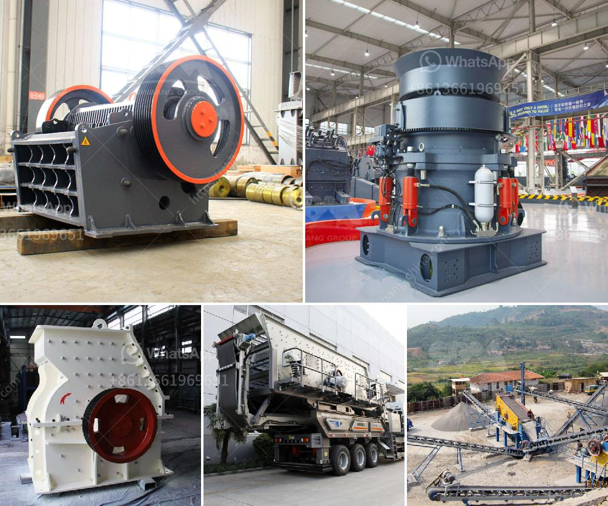

<h3>start m sand unit kerala cost</h3>
Starting an M Sand unit in Kerala can be a great business opportunity for entrepreneurs looking to venture into the construction industry. M Sand, also known as Manufactured Sand, is an alternative to river sand used in the construction industry to produce concrete and plaster.

One of the main advantages of M Sand is that it is readily available and can be produced from stones extracted from quarries. This eliminates the need for excessive mining of river sand, which has been causing significant environmental problems, including threatening the existence of riverbeds and causing river erosion. Moreover, M Sand has consistent grain size and shape, making it an ideal material for construction.

Before setting up an M Sand unit in Kerala, it is essential to consider several factors, including cost, licensing, and market demand. The cost of setting up an M Sand unit can vary depending on various factors, such as the size of the unit, machinery, raw materials cost, and the location. Generally, it would cost approximately between INR 25 lakhs to INR 50 lakhs to set up a small-scale M Sand unit.

To start an M Sand unit, entrepreneurs need to obtain the necessary licenses and permissions from the appropriate government authorities. They would typically need to register the business as a Proprietary Firm, Partnership Firm, or Private Limited Company. Additionally, obtaining environmental clearance and consent to operate from the State Pollution Control Board is crucial for the unit's smooth functioning.

Once all the necessary licenses are obtained, entrepreneurs can start procuring the required machinery and equipment for the M Sand unit. The essential machinery includes jaw crushers, vibratory screens, vertical shaft impactors (VSI), and washing units, among others. The machinery cost can vary depending on the capacity and quality of the machines purchased.

Raw materials for producing M Sand primarily include stones and aggregates procured from quarries. It is essential to ensure a consistent supply of high-quality raw materials to maintain the M Sand's desired quality. Entrepreneurs need to establish reliable relationships with quarry owners or suppliers to ensure a steady supply of raw materials.

To market the M Sand produced, entrepreneurs can approach construction companies, contractors, and individual customers such as homeowners, builders, and architects. It is crucial to network and establish good relationships within the construction industry to secure orders. Offering competitive pricing, high-quality products, and timely delivery will help attract and retain customers.

In terms of operating costs, the major expenses for an M Sand unit include labor wages, electricity charges, maintenance and repair costs, raw material transportation, and marketing expenses. Keeping these costs in check and ensuring efficient operations is vital for the unit's profitability.

Running an M Sand unit in Kerala can be a profitable business venture due to the increasing demand for M Sand in the construction industry. However, it is crucial to conduct thorough market research, analyze the competition, and develop a robust business plan before starting the unit. Furthermore, complying with all legal and environmental regulations is essential to avoid any complications in the future.

In conclusion, starting an M Sand unit in Kerala can be a lucrative business opportunity for entrepreneurs in the construction industry. With careful planning, proper licensing, and efficient operations, entrepreneurs can establish a successful M Sand unit, contributing to the growth of the construction sector while minimizing the environmental impact of river sand mining.
<h3>Contact us</h3><ul><li><strong>Whatsapp:&nbsp;<a href="https://wa.me/8613661969651">+8613661969651</a></strong></li><li><a href="https://swt.shibang-china.com/?git&amp;zhl&amp;start m sand unit kerala cost"><strong>Online Service(chat now)</strong></a></li></ul><h3>Related</h3><ul><li><a href='cost of crushing equipments in nigeria.md'>cost of crushing equipments in nigeria</a></li><li><a href='conveyor belt manufacturers in kolkata.md'>conveyor belt manufacturers in kolkata</a></li><li><a href='jaw crusher baxter.md'>jaw crusher baxter</a></li><li><a href='mobile gypsum crusher.md'>mobile gypsum crusher</a></li><li><a href='dolomite powder making equipment.md'>dolomite powder making equipment</a></li></ul>