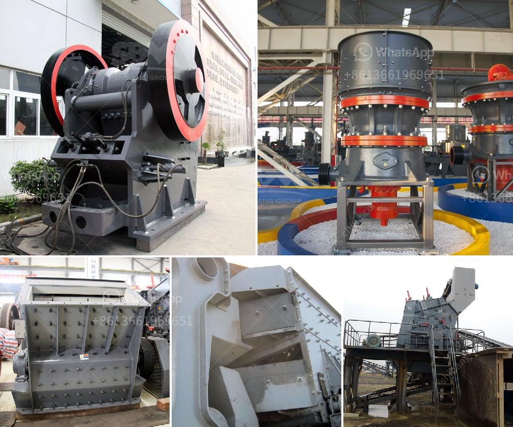

<h3>static jaw crusher for sale</h3>
A static jaw crusher is a type of machine that is extensively used in the fields of mining and quarrying. It is designed to reduce the size of large rocks into smaller rocks, gravel, or rock dust. This type of crusher is commonly used in primary crushing applications. Static jaw crushers are renowned for their durability and excellent performance, making them an ideal choice for rugged use in heavy-duty mining and quarrying applications.

One of the key features of a static jaw crusher is its ability to crush materials of any hardness. This versatility allows operators to handle a wide range of materials, including hard and abrasive rocks. The powerful crushing action of the jaw crusher breaks down the material into smaller sizes, making it easier to handle and transport.

Another advantage of a static jaw crusher is its simplicity of operation. With no moving parts, this type of crusher is relatively easy to maintain and operate. It requires minimal maintenance and is known for its long service life. This makes it a cost-effective option for many mining and quarrying operations.

Static jaw crushers are available in various sizes and capacities to suit different crushing requirements. They are typically used as primary crushers, allowing the material to be processed further downstream. In addition, some static jaw crushers can also be used for secondary crushing, depending on the application.

One of the main factors to consider when purchasing a static jaw crusher is the feed size. The feed size determines the maximum size of the material that can be fed into the crusher. It is important to choose a jaw crusher that is capable of handling the maximum feed size of the material to be crushed. This will ensure optimal performance and efficiency.

When looking for a static jaw crusher for sale, it is essential to consider the overall condition of the machine. Inspect the crusher for any signs of wear or damage. Check the moving parts for proper functionality and lubrication. It is also important to assess the overall condition of the crusher's motor and electrical components.

In conclusion, a static jaw crusher is a reliable and durable machine that offers excellent performance in various mining and quarrying applications. Its ability to handle a wide range of materials and its simplicity of operation makes it a popular choice for many operators. When looking for a static jaw crusher for sale, it is important to consider factors such as feed size, overall condition, and the specific requirements of the application. By choosing the right static jaw crusher, operators can enhance their operation's productivity and efficiency.
<h3>Contact us</h3><ul><li><strong>Whatsapp:&nbsp;<a href="https://wa.me/8613661969651">+8613661969651</a></strong></li><li><a href="https://swt.shibang-china.com/?git&amp;zhl&amp;static jaw crusher for sale"><strong>Online Service(chat now)</strong></a></li></ul><h3>Related</h3><ul><li><a href='gold milling plant in zimbabwe.md'>gold milling plant in zimbabwe</a></li><li><a href='silica sand mining equipment.md'>silica sand mining equipment</a></li><li><a href='used mobile crusher.md'>used mobile crusher</a></li><li><a href='barite raymond mill.md'>barite raymond mill</a></li><li><a href='grinder rock crusher.md'>grinder rock crusher</a></li></ul>