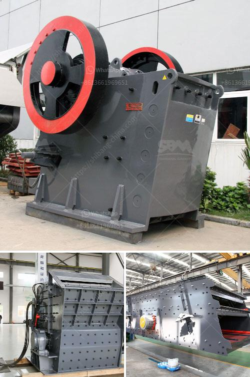

<h3>steed conveyor belting</h3>
Conveyor systems play a crucial role in various industries, ensuring the smooth and efficient movement of materials from one point to another. With the increasing demand for high-quality conveyor belting, Steed Conveyor Belting has emerged as a leading provider in the market. Their innovative designs and commitment to customer satisfaction make them the go-to choice for businesses looking for reliable and durable conveyor belting solutions.

One of the key factors that sets Steed Conveyor Belting apart from its competitors is its extensive range of conveyor belts. Whether you need belts for mining, agriculture, food processing, or any other industry, Steed Conveyor Belting has got you covered. Their team of experts understands the specific requirements of each industry and designs conveyor belts that are both efficient and durable. From heavy-duty belts capable of handling large loads to lightweight options for small-scale operations, Steed Conveyor Belting provides customized solutions to cater to the diverse needs of its clients.

Durability is another significant aspect that makes Steed Conveyor Belting stand out. The company uses high-quality materials that are designed to withstand the toughest of conditions. Whether it's extreme temperatures, abrasive materials, or heavy impact, Steed Conveyor Belting ensures that their belts perform consistently without compromising on quality. This durability factor not only improves the lifespan of the conveyor belts but also minimizes the frequency of maintenance and replacements, resulting in cost savings for businesses.

In addition to durability, Steed Conveyor Belting prioritizes efficiency and safety. Their belts are designed to optimize material flow, ensuring maximum productivity and minimizing downtime. The smooth operation of their conveyor belts guarantees a continuous and uninterrupted workflow, contributing to increased efficiency in the production and distribution process.

Furthermore, Steed Conveyor Belting understands the importance of safety in the workplace. Their conveyor belts incorporate various safety features, such as anti-slip surfaces, interruption sensors, and emergency stop mechanisms. These features provide peace of mind to businesses, knowing that the well-being of their employees is prioritized and accidents are minimized.

What makes Steed Conveyor Belting even more appealing is their commitment to exceptional customer service. Their team of experts works closely with clients to understand their specific requirements and provide tailored solutions accordingly. From the initial consultation to installation and beyond, Steed Conveyor Belting ensures that the entire process is seamless and hassle-free. Their prompt response to queries and dedication to customer satisfaction have earned them a reputation for excellence in the industry.

In conclusion, Steed Conveyor Belting is a leading provider of conveyor belts, offering customized solutions for a wide range of industries. Their commitment to durability, efficiency, safety, and customer satisfaction sets them apart from their competitors. With Steed Conveyor Belting, businesses can enhance their material handling operations, improve productivity, and reduce overall costs. When it comes to reliable and durable conveyor belting, Steed Conveyor Belting is the ultimate solution.
<h3>Contact us</h3><ul><li><strong>Whatsapp:&nbsp;<a href="https://wa.me/8613661969651">+8613661969651</a></strong></li><li><a href="https://swt.shibang-china.com/?git&amp;zhl&amp;steed conveyor belting"><strong>Online Service(chat now)</strong></a></li></ul><h3>Related</h3><ul><li><a href='part of ball mills.md'>part of ball mills</a></li><li><a href='tph stone crushers with vsi in india.md'>tph stone crushers with vsi in india</a></li><li><a href='price of copper ore crushing machine.md'>price of copper ore crushing machine</a></li><li><a href='calcium roller mill.md'>calcium roller mill</a></li><li><a href='mobile crusher triman.md'>mobile crusher triman</a></li></ul>