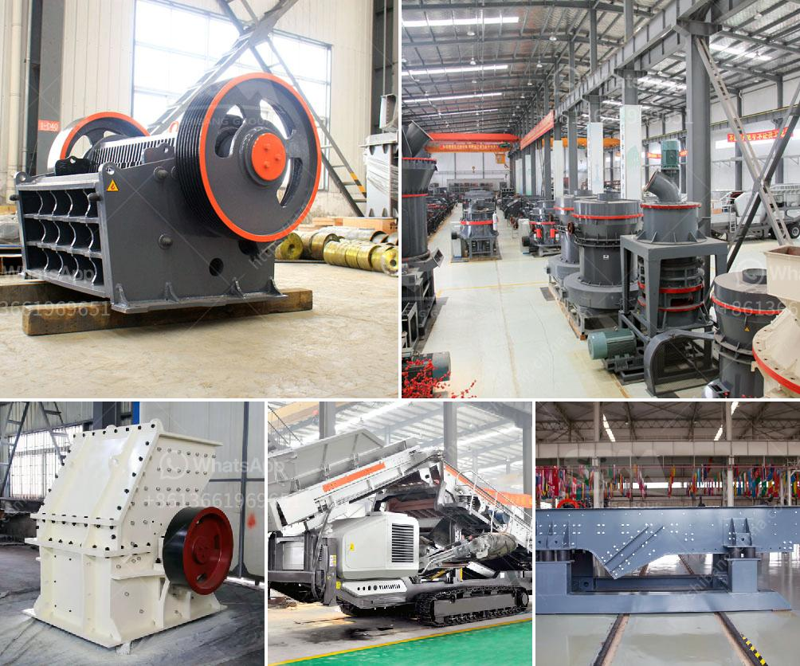

<h3>steel hammer mill</h3>
A steel hammer mill is a type of machine that is used to shred or crush materials into smaller pieces. It features a cylindrical drum that is made up of steel plates or chambers. These plates or chambers contain hammers, which are free to swing and beat the material being crushed. The hammer mill operates on the principle of impact and attrition, which involves the collision of particles against hammers and the liner of the mill.

The use of steel in a hammer mill ensures the durability and longevity of the machine. Steel is known for its strength and resistance to wear and tear. It can handle tough and abrasive materials effectively without losing its shape or structure. The steel hammer mill is suitable for processing various types of materials, including grains, biomass, and industrial waste.

When it comes to grinding or shredding operations, the steel hammer mill provides several advantages. Firstly, it can handle large quantities of material at a high speed. The swinging hammers continuously strike the incoming particles, breaking them down into smaller sizes. This results in a more efficient and faster grinding process.

Secondly, the steel hammer mill is versatile and can be used for multiple applications. It can produce fine powders or coarse particles depending on the desired outcome. Different sizes of screens or grates can be installed to control the particle size produced by the mill. This feature allows for customization and flexibility in various industries and sectors.

Another advantage of the steel hammer mill is its low maintenance requirement. Regular inspection and cleaning of the machine is necessary to ensure optimal performance. However, the steel construction reduces the wear and tear on the mill components, minimizing the need for frequent replacements or repairs. This not only saves time and cost but also increases the overall productivity of the operation.

Furthermore, the steel hammer mill is energy efficient. It utilizes the impact force of the hammers, consuming less power compared to other grinding machines. This makes it an environmentally friendly choice that reduces energy consumption and lowers operating costs.

In conclusion, a steel hammer mill is a reliable and efficient machine for grinding and crushing various materials. Its robust construction ensures durability and longevity, while its versatility allows for customization and adaptation to different applications. The low maintenance requirement and energy efficiency make it an attractive option for industries that require size reduction processes. Whether in the food, biomass, or recycling industry, a steel hammer mill is a valuable asset that can enhance productivity and improve the quality of processed materials.
<h3>Contact us</h3><ul><li><strong>Whatsapp:&nbsp;<a href="https://wa.me/8613661969651">+8613661969651</a></strong></li><li><a href="https://swt.shibang-china.com/?git&amp;zhl&amp;steel hammer mill"><strong>Online Service(chat now)</strong></a></li></ul><h3>Related</h3><ul><li><a href='portable stone crusher machine for sale.md'>portable stone crusher machine for sale</a></li><li><a href='price of medium quarry plant.md'>price of medium quarry plant</a></li><li><a href='crusher stone price south africa.md'>crusher stone price south africa</a></li><li><a href='price of mobile stone crusher.md'>price of mobile stone crusher</a></li><li><a href='manufacturing equipments of lime stone milling.md'>manufacturing equipments of lime stone milling</a></li></ul>