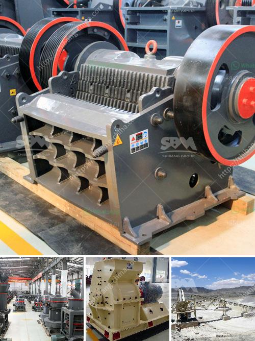

<h3>stone crusher and quarry plant in galway ireland</h3>
Stone crushing is a widely used occupation in Galway, Ireland, mainly in the construction sector. Crushing and quarrying activities entail excavating the site and machinery can be seen processing various types of stone, often throughout the day.

Stone crushing in Galway, Ireland is widespread, and quarrying is a common process because quarries are required to provide raw materials for various construction projects. This practice is destructive and has caused significant environmental impacts in the area.

The process starts with the excavation of the site, usually with the use of heavy equipment such as excavators and dump trucks. The extracted stone is then transported to the crusher plant, where it is broken down into smaller pieces using crushers and screens. The crushed stone is then used for various construction projects, such as road building, concrete production, and landscaping.

However, the stone crushing and quarrying operations have raised concerns among environmentalists and nearby residents. The noise and dust generated during the crushing process can have adverse effects on the surrounding environment and human health. The constant use of heavy machinery also contributes to air and water pollution in the area.

Additionally, quarrying activities can disrupt the natural habitats of local wildlife, causing animals to flee or permanently leave the area. This can have a detrimental impact on the biodiversity of the region. The constant removal of stones from the quarry also affects the stability of the land, leading to potential landslides and soil erosion.

In recent years, there has been growing pressure from environmental groups to regulate and minimize the negative impacts of stone crushing and quarrying. Authorities have implemented stricter regulations to control the operation of stone crushers and quarry plants. These regulations aim to reduce noise pollution, control dust emissions, and promote responsible quarrying practices.

Additionally, quarry operators are increasingly encouraged to rehabilitate their sites after extraction is complete. This involves restoring the land to its original or an acceptable condition by filling in pits, planting vegetation, and creating wildlife habitats. By restoring the quarries, the environmental impact can be minimized, and the area can be reclaimed for future use.

In conclusion, stone crushing and quarrying have played a significant role in the construction sector in Galway, Ireland. However, the practice has caused environmental concerns due to noise and dust pollution, disruption of habitats, and land instability. Efforts are being made to regulate and minimize the negative impacts through stricter regulations and rehabilitation of quarry sites. With responsible quarrying practices, it is possible to mitigate the environmental impact and maintain a sustainable stone crushing industry.
<h3>Contact us</h3><ul><li><strong>Whatsapp:&nbsp;<a href="https://wa.me/8613661969651">+8613661969651</a></strong></li><li><a href="https://swt.shibang-china.com/?git&amp;zhl&amp;stone crusher and quarry plant in galway ireland"><strong>Online Service(chat now)</strong></a></li></ul><h3>Related</h3><ul><li><a href='rock cutting and grinding machine price.md'>rock cutting and grinding machine price</a></li><li><a href='mobile crusher machine manufacturer.md'>mobile crusher machine manufacturer</a></li><li><a href='stone grinding roller mill for sale.md'>stone grinding roller mill for sale</a></li><li><a href='material vibrator feeder.md'>material vibrator feeder</a></li><li><a href='gypsum making machine india.md'>gypsum making machine india</a></li></ul>