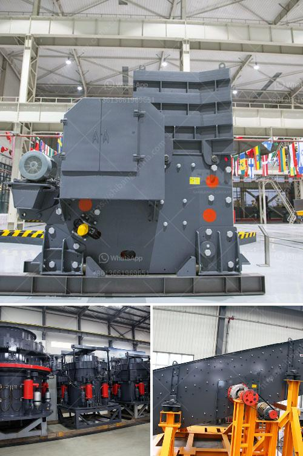

<h3>stone crusher cebu for sale in kenya</h3>
Cebu is one of the fastest-growing metropolitan areas in the Philippines. Several industries thrive in this area, including mining and construction. As a result, there is a growing demand for stone crushers to meet the growing needs of various industries.

Cebu, located in the central part of the Philippines, is known for its beautiful beaches and rich cultural heritage. However, it also has a well-developed infrastructure, making it an ideal place for businesses to flourish. A significant industry in Cebu is mining. Various minerals, such as limestone and basalt, are abundant in the region. These minerals are used in construction and other manufacturing industries.

To extract the minerals from the mines, stone crushers play a crucial role. These machines break large rocks into smaller, more manageable sizes. The crushed stones are used as raw materials for various purposes, including road construction, building materials, and concrete production. Stone crushers are therefore in high demand in Cebu.

If you are in the market for a stone crusher in Cebu, there are numerous options available. Local suppliers and manufacturers offer a wide range of crushers that cater to different needs and budgets. Whether you need a small portable crusher for a construction project or a heavy-duty crusher for mining purposes, you can find the right equipment in Cebu.

One popular stone crusher for sale in Cebu is the PE jaw crusher, which is ideal for primary crushing. These machines have a high capacity and can produce high-quality output materials. They are also known for their durability, making them suitable for rugged environments.

In conclusion, the stone crusher market in Cebu is thriving due to the growing demand in various industries. If you are in the market for a stone crusher, explore the numerous options available in Cebu. Whether you need a small crusher for a construction project or a heavy-duty machine for mining purposes, there are suppliers and manufacturers that can cater to your needs. Invest in a high-quality stone crusher and contribute to the growth and development of the vibrant Cebu market.
<h3>Contact us</h3><ul><li><strong>Whatsapp:&nbsp;<a href="https://wa.me/8613661969651">+8613661969651</a></strong></li><li><a href="https://swt.shibang-china.com/?git&amp;zhl&amp;stone crusher cebu for sale in kenya"><strong>Online Service(chat now)</strong></a></li></ul><h3>Related</h3><ul><li><a href='limestone crushing processing for the manufacturer.md'>limestone crushing processing for the manufacturer</a></li><li><a href='talc raymond grinding mill.md'>talc raymond grinding mill</a></li><li><a href='mining equipment for hire zimbabwe.md'>mining equipment for hire zimbabwe</a></li><li><a href='stone crushing equipment price in nigeria.md'>stone crushing equipment price in nigeria</a></li><li><a href='price of medium quarry plant.md'>price of medium quarry plant</a></li></ul>