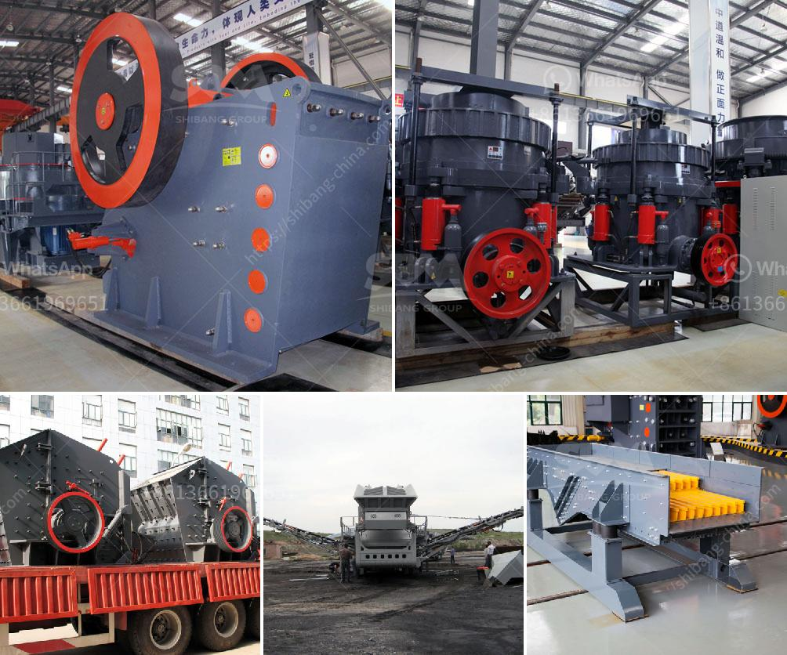

<h3>stone crusher company india mastro</h3>
In today's globalized world, the significance of building and construction materials cannot be underestimated. They are essential for every sector of the infrastructure development, particularly road building. The use of good quality stone crushing equipment is essential for producing consistent end products, thereby providing the most comprehensive product lines for today's farmers.

For effective stone crushing equipment, it is vital to perform regular maintenance and servicing. This ensures that the machinery stays in good shape, and the stones are crushed to the desired size.

Stone Crusher Companies India Mastro employs skilled workforce to perform regular maintenance to ensure that proper quality is maintained. Stone crushing is a significant sector in India's economy and contributes to the country's GDP.

This particular sector regularly employs large amounts of rural labor, providing employment to thousands of people. Additionally, it is an essential source of raw material for various construction activities such as building roads, highways, bridges, buildings, and canals.

The importance of stone crushing is evident from its utilization in virtually all major infrastructure projects. Be it building roads, water reservoirs, airports, or any other large-scale construction project, stone crushing is used to supply the required material for these projects.

Stone crushing involves crushing various stones, primarily limestone, granite, and basalt. The crushed stone is used as raw material for various construction activities like construction of roads, bridges, buildings, and canals. The stone crushing sector is an important industrial sector in India.

India's most reliable stone crusher company, Mastro, manufactures a wide range of crushing equipment. It includes jaw crushers, impact crushers, cone crushers, vibrating screens, and feeders, among other specialized equipment. They provide high-quality machinery with various features that deliver outstanding performance, and they are widely used in various construction and mining industries.

Besides manufacturing state-of-the-art crushing equipment, Mastro also offers comprehensive after-sales services. Their dedicated service team ensures that the company's machinery stays in excellent condition and operates efficiently. Mastro provides regular maintenance services, including equipment inspection, component replacement, and refurbishment.

Mastro's reliability and unmatched customer service make them the leading stone crusher company in India. Their focus on continuous innovation and technology integration ensures that their machines are at the forefront of the industry.

Stone crushing is a vital sector in India, providing substantial employment opportunities for rural laborers and contributing to the country's GDP. Stone Crusher Company India Mastro is a leading provider of stone crushing equipment in India. The company offers a wide range of machinery and experienced technicians for exceptional quality, performance, and after-sales service.

Investing in reliable stone crushing equipment is crucial for efficient operation, reduced downtime, and maximum productivity. Mastro's commitment to delivering high-quality machinery and comprehensive after-sales services makes them the preferred choice for construction companies across India.
<h3>Contact us</h3><ul><li><strong>Whatsapp:&nbsp;<a href="https://wa.me/8613661969651">+8613661969651</a></strong></li><li><a href="https://swt.shibang-china.com/?git&amp;zhl&amp;stone crusher company india mastro"><strong>Online Service(chat now)</strong></a></li></ul><h3>Related</h3><ul><li><a href='quartz stone machine in turkey.md'>quartz stone machine in turkey</a></li><li><a href='list used cement factory for sale in germany.md'>list used cement factory for sale in germany</a></li><li><a href='track mounted coal crushers indonesia.md'>track mounted coal crushers indonesia</a></li><li><a href='ball price for 200 tons.md'>ball price for 200 tons</a></li><li><a href='vibrating screening machine.md'>vibrating screening machine</a></li></ul>