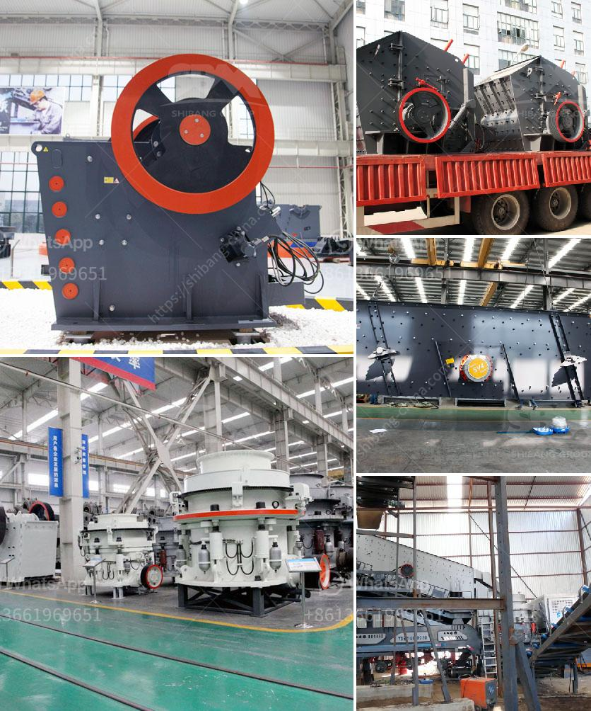

<h3>stone crusher design</h3>
Stone crushing is an important part in mining industry and require high quality stone crushing machines in order to maximize the benefits of quarrying, which can bring more profits to the miners. There are many different types of stone crusher machines in the market, each with their own specifications and uses.

Several factors influence the choice of stone crusher machine including the type of mine or quarry, the location, the intended use of the material, the hardness, and other factors. Stone crusher machines are widely used in mining industry, construction industry, metallurgy industry, and so on.

Designing a stone crusher machine and formulating a plan is very important. For this purpose, several important elements should be considered such as the type of stone to be crushed, the maximum size of the stone to be crushed, the hardness of the stone, the target particle size, the product size distribution, the capacity, the required power input, and so on.

The design of a stone crusher machine is influenced by various factors such as the type of mine or quarry to be crushed, the location, the intended use of the material, the hardness, and other factors. The crusher machines also play a vital role in the construction industry, as they help in reducing large rocks into small gravels or rock dusts.

The designing and manufacturing of stone crushers and other crushing equipment is undertaken by a team of professionals with years of experience in the field. The stone crusher design can have a number of purposes. Some of them being the reduction of size of a rock in the objective of achieving proper liberation of valuable minerals or metals. Some of the crushers are also used for the treatment of household garbage, industrial waste, and other kinds of materials.

The stone crusher design can be modified to suit the specific job requirements of the miners. For instance, the setup time of the machine can be reduced or eliminated by incorporating a remote control system. The machine can also be equipped with sensors or detectors to ensure proper functioning even in adverse conditions.

The stone crusher design also includes a mechanism for compacting the stone material, and other equipment to improve efficiency and reduce labor costs. The stone crusher mechanism can ensure the consistency of the rocks, as the stones are crushed in a uniform manner without any variation in size or shape.

In conclusion, the stone crusher machine design must be ultimately determined by the end users and the type of materials they are dealing with. Various factors influence the design of a stone crusher machine, including the nature of the materials to be crushed, the required output size, the capacity of the machine, and other factors. These considerations can help determine the optimal design for a certain application, thereby ensuring maximum productivity and efficiency in the long run.
<h3>Contact us</h3><ul><li><strong>Whatsapp:&nbsp;<a href="https://wa.me/8613661969651">+8613661969651</a></strong></li><li><a href="https://swt.shibang-china.com/?git&amp;zhl&amp;stone crusher design"><strong>Online Service(chat now)</strong></a></li></ul><h3>Related</h3><ul><li><a href='types of conveyor belts.md'>types of conveyor belts</a></li><li><a href='mobile crushing price uk.md'>mobile crushing price uk</a></li><li><a href='floatation equipment for mining for sale in south africa.md'>floatation equipment for mining for sale in south africa</a></li><li><a href='pe series jaw crusher rate 1000ton per hour.md'>pe series jaw crusher rate 1000ton per hour</a></li><li><a href='mobile stone crusher for sale in south africa.md'>mobile stone crusher for sale in south africa</a></li></ul>