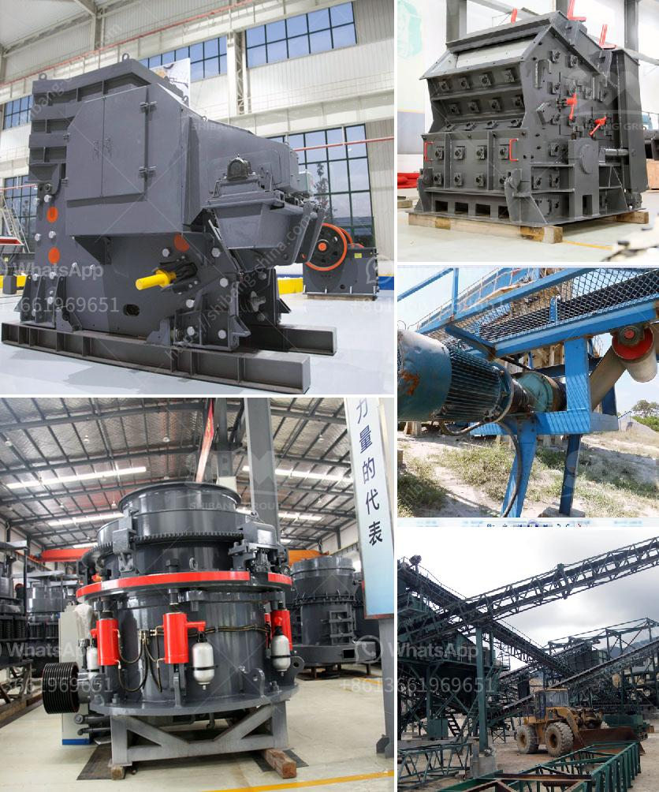

<h3>stone crusher equipment quarry</h3>
Stone crusher equipment is widely used in the quarry and mining industry nowadays. It is especially suitable for the primary and secondary crushing of all kinds of rocks and ores, which compressive strength is less than 320MPa.

The stone crusher equipment is capable of crushing different types of rocks efficiently and effectively. It has a wide range of applications in the quarrying industry, including granite, limestone, gravel, and more.

The equipment has a high crushing ratio, enabling the crusher to operate efficiently. The high-quality steel material used ensures the durability of the equipment and reduces the maintenance cost. Additionally, the advanced technology employed in the equipment makes the crushing process more efficient.

In a quarry, stone crusher machines are used to crush stones into smaller particle sizes for further processing. In the quarry, there are several stages of crushing that take place to obtain the desired size of the stone aggregate. Firstly, large-sized rocks are fed into the jaw crusher for primary crushing. Then, the stones are conveyed to a cone crusher for secondary crushing. After that, they undergo several processes, such as screening, washing, and shaping, to get the final product.

The stone crusher equipment in the quarry is mainly used for crushing various ores and bulk materials into medium-sized particles. The quarrying process consists of various stages including blasting, transportation, crushing, screening, and grinding. During each stage, the crushing equipment plays an important role in the process.

The stone crusher equipment is also widely used in road construction. This is because it is able to provide the required aggregates for the road construction project, which ultimately contributes to the smooth and safe movement of vehicles on the road. Moreover, the crushed stones can be used as materials for the construction of sidewalks, driveways, and other infrastructure projects.

Apart from the quarry and construction industry, the stone crusher equipment is also used in other fields, such as mining, chemical, cement, and metallurgy. It performs the task of crushing raw materials into smaller particles for further processing. In the mining industry, it is used to crush large chunks of ore into smaller pieces that can be processed more efficiently.

In conclusion, stone crusher equipment plays a vital role in the mining and quarrying industry. Whether it is by blasting the large rocks or breaking them down into smaller pieces, the equipment ensures reliable, efficient, and safe operations. It not only saves time but also improves the overall productivity of the quarrying process. Therefore, investing in high-quality stone crusher equipment is a wise decision for any quarry or mining operation.
<h3>Contact us</h3><ul><li><strong>Whatsapp:&nbsp;<a href="https://wa.me/8613661969651">+8613661969651</a></strong></li><li><a href="https://swt.shibang-china.com/?git&amp;zhl&amp;stone crusher equipment quarry"><strong>Online Service(chat now)</strong></a></li></ul><h3>Related</h3><ul><li><a href='4 roller mill nigeria.md'>4 roller mill nigeria</a></li><li><a href='crusher stone prices.md'>crusher stone prices</a></li><li><a href='sample of granite quarry proposal.md'>sample of granite quarry proposal</a></li><li><a href='iron ore crushing plant setup cost in india.md'>iron ore crushing plant setup cost in india</a></li><li><a href='crusher stone price south africa.md'>crusher stone price south africa</a></li></ul>